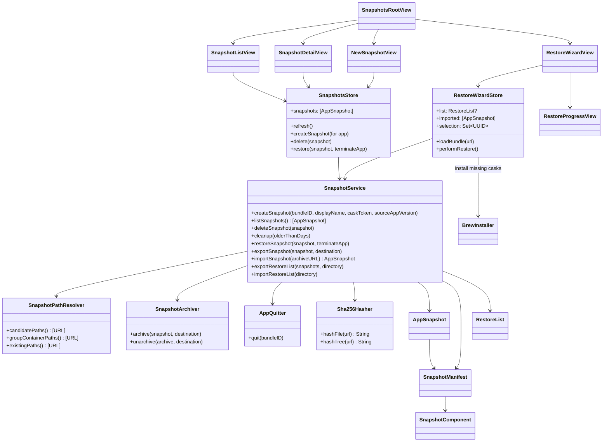
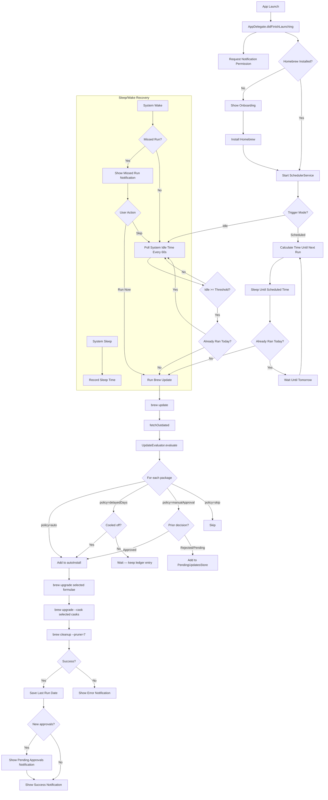
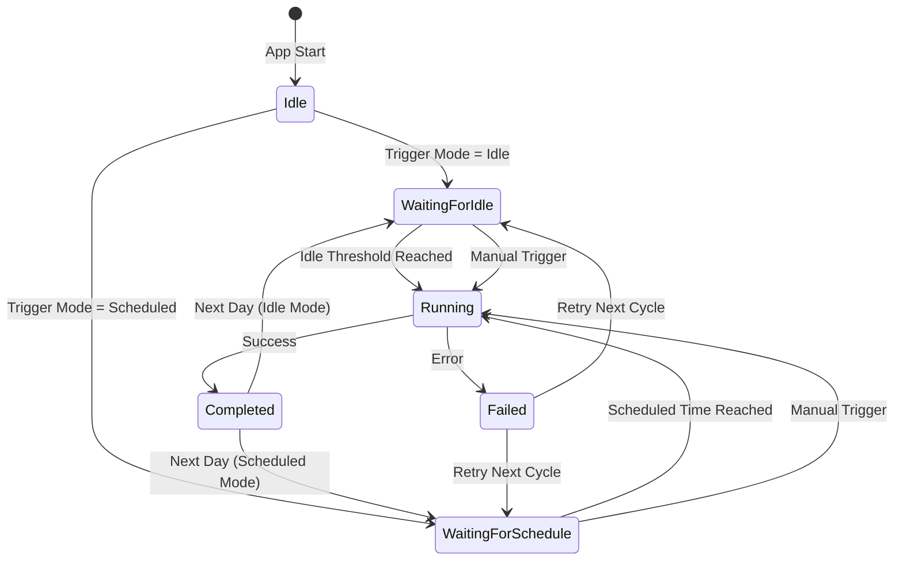

# AutoBrew

A native macOS menu bar app that automatically keeps Homebrew and all installed packages up to date — silently, in the background.

## Features

- **Automatic Updates** — Runs `brew update → policy gate → selective brew upgrade → brew cleanup` once daily
- **Selective Update Policy** — Per-bump-type and per-package rules: patches roll out fast, minors wait a configurable cool-off, majors require explicit approval
- **In-App Legal Section** — Privacy, Terms, EULA, Imprint, Trademark, Open-Source licenses — localized into all supported languages
- **Idle-Based Trigger** — Waits for configurable idle time before running (default: 30 min)
- **Scheduled Trigger** — Alternatively, run at a fixed time of day
- **Works While Locked** — Uses IOKit idle detection, independent of screen lock state
- **Missed Run Recovery** — If the Mac was asleep during a scheduled run, prompts the user on wake
- **Outdated Package List** — Shows outdated formulae and casks with current and available versions
- **Homebrew Auto-Install** — Installs Homebrew automatically if not present (guided onboarding)
- **Login Item** — Starts automatically with the system via SMAppService
- **Auto-Updates** — Keeps itself up to date via Sparkle
- **8 Languages** — English, German, French, Italian, Dutch, Polish, Portuguese (Brazil), Spanish

## BrewStore

Starting with version 2.0.0, AutoBrew ships a full Homebrew GUI and an AppSnapshot engine.

### Discover & Browse
Full Homebrew cask catalog (`formulae.brew.sh`) organised as App-Store-style Discover sections plus hand-curated categories (Browsers, Developer Tools, Productivity, …), each ranked by 365-day install popularity. Every row has a hover tooltip with the full description and the brew token for `@variant` casks. Variants (`alfred`, `alfred@4`, `alfred@prerelease`) are decorated in the title — "Alfred", "Alfred 4", "Alfred (Prerelease)" — so they're never visually identical.

### Global Search
The sidebar search field walks the entire cask catalog (token, name, description) regardless of which section is selected. Clearing the field returns the user to whatever they were looking at before.

### Installed
Scans `/Applications` and `~/Applications`, reconciles each `.app` bundle against `brew info --cask --json=v2 --installed` so:
- Apps installed manually (DMG, drag-to-Applications) show up without a cask token — no Upgrade/Uninstall buttons that would fail.
- Apps installed via a **custom Homebrew tap** are still tracked correctly (uses `full_token` instead of the public catalog).
- When several casks share the same `.app` (`alfred` vs `alfred@4`), the row reflects which cask brew is actually managing — not whichever the public catalog happened to list first.

Per app: create snapshot, upgrade via Brew, or uninstall.

### Snapshots

A snapshot is a point-in-time copy of **everything an application owns outside its `.app` bundle** — its preferences, its sandbox data, its caches, its login items. Combined, those folders are what makes an app "yours" after a fresh install. Without them, reinstalling Slack means re-signing in, reinstalling Visual Studio Code means losing every extension and setting, etc.

#### What gets captured

For each app, AutoBrew copies the contents of these standard macOS user-data locations (where they exist):

| Path | Purpose |
|---|---|
| `~/Library/Preferences/<bundleID>.plist` | UserDefaults — settings, recent items, window positions |
| `~/Library/Application Support/<bundleID>/` | App-managed data — databases, projects, extensions |
| `~/Library/Containers/<bundleID>/` | App-Sandbox data (sandboxed apps store everything here) |
| `~/Library/Saved Application State/<bundleID>.savedState/` | Window restoration on next launch |
| `~/Library/Group Containers/<groupID>/` | Shared data between an app and its extensions |
| `~/Library/Caches/<bundleID>/` | Caches — included for completeness, opt out in Settings if you'd rather not |

Each file plus every directory tree gets a **SHA-256 hash** in the manifest. On restore the hash is recomputed and compared — if the archive was tampered with, the restore aborts before touching your disk.

#### Storage on the source Mac

Snapshots live under `~/Library/Application Support/AutoBrew/Snapshots/`, one folder per snapshot. Folder name is `<bundleID>_<timestamp>` so they sort chronologically. Each folder contains the raw component copies plus a `manifest.json` with:

- App's bundle ID, display name, version at snapshot time
- Cask token (when AutoBrew can resolve it)
- Component list with paths, sizes, and hashes
- Snapshot creation timestamp

#### Restore flow

1. AutoBrew offers to **terminate the running app** (you can opt out — restore over a running app risks data corruption).
2. The current state of every component path is **rolled into a transactional backup** next to the original — if anything fails midway, the original state is restored.
3. Components are copied from the snapshot into their target paths.
4. Hashes are recomputed and compared against the manifest. Mismatch → roll back.
5. On success, the temporary backup is removed and the user can relaunch the app.

#### Cross-Mac migration

- **Single-snapshot export** — `.autobrewsnapshot` file: a ZIP bundle (created with `ditto -c -k --sequesterRsrc` so extended attributes and symlinks survive) containing the raw components plus `manifest.json`. Double-clickable from Finder, or attach to a message.
- **Bulk export** — `.autobrewbundle` directory containing one `.autobrewsnapshot` per app plus a `restore_list.json` index. Use this when migrating a whole Mac.
- **Restore wizard** — point AutoBrew at an `.autobrewsnapshot` or an `.autobrewbundle`:
  1. The manifests are validated (bundle IDs non-empty, components ≥ 1, hashes well-formed).
  2. You pick which apps to restore.
  3. If a target app isn't installed yet, AutoBrew runs `brew install --cask <token>`; if the cask was renamed since the snapshot, `brew search` is used to find the replacement (so a snapshot taken under `vscode` still restores after Homebrew renamed the cask to `visual-studio-code`).
  4. Each picked app is restored via the same transactional flow as a local restore.

#### What snapshots don't capture

- Files outside the standard user-data locations (e.g. data dumped under `/Library/...` system-wide, or in custom-configured paths)
- App Store receipts (StoreKit re-verifies on first launch, so this normally just means signing in again)
- License keys stored in the macOS Keychain (Keychain isn't snapshotted — restore the app and re-enter the licence)
- Files actively being written by the app at the moment of snapshot (that's why AutoBrew offers to terminate it first)

#### How it works under the hood

The snapshot subsystem is three Swift services collaborating with a small amount of disk state:

- **`SnapshotPathResolver`** — given a bundle ID, returns every candidate user-data path that exists on disk (the table above). Lookups are cheap (file-existence checks only); paths that don't exist are skipped, so the manifest only carries real components.
- **`Sha256Hasher`** — streams a file or directory tree through `CryptoKit.SHA256` in chunks, so even multi-gigabyte caches don't blow up memory. Directory trees are hashed deterministically: each entry is fed in with a length-prefixed binary encoding (relative path → file mode → file content hash → entry-terminator byte) so the hash is stable across runs as long as the contents and structure didn't change.
- **`SnapshotArchiver`** — wraps Apple's `ditto -c -k --sequesterRsrc` to ZIP/UNZIP. Using `ditto` instead of `zip` matters: it preserves macOS extended attributes (`com.apple.metadata:*`), the resource fork on legacy files, and symlinks pointing inside the bundle. Archives created with `zip` would silently lose all of that and produce subtly broken restores.

**Create flow** (`SnapshotService.createSnapshot`):

1. Resolve all candidate paths via the resolver. If the set is empty after filtering, the snapshot is **rejected** — an empty snapshot is more dangerous than no snapshot (it would "restore" a wiped state).
2. Stream-copy each path into a fresh `<bundleID>_<timestamp>/` folder under `~/Library/Application Support/AutoBrew/Snapshots/`.
3. Compute the SHA-256 for each component (file → file hash, directory → tree hash).
4. Write `manifest.json` last, atomically. If the process is killed before this step, the folder is partial and ignored by the snapshot list — no half-state.

**Restore flow** (`SnapshotService.restoreSnapshot`):

1. Re-verify every component hash against the manifest. Mismatch → abort with `BrewError.snapshotCorrupted`.
2. Offer to quit the app via `AppQuitter` — polite `terminate()` first, then `forceTerminate()` after `timeout` seconds; cancellable.
3. For every component path, the current state is renamed in place to `<path>.autobrew-rollback-<uuid>` (zero-copy, atomic on the same filesystem). At this point the original is staged for cleanup but still recoverable.
4. The snapshot version is copied into the target path.
5. Hashes are recomputed on the **written** files and compared against the manifest. Any mismatch triggers the rollback step.
6. On success, the `.autobrew-rollback-*` siblings are deleted. On failure, they are renamed back over the failed restore and the leftover write attempt is removed.

**Auto-cleanup** (Settings → Snapshots → "Auto-clean up old snapshots"): after every successful Brew run, `SnapshotService.cleanup(olderThanDays:)` walks the snapshot folder and removes any folder whose `manifest.json` creation timestamp is older than the configured retention window (default 90 days). Snapshots without a parseable manifest are left alone — we'd rather keep orphans than delete by guess.

**Export** (`SnapshotService.exportSnapshot`) zips the folder with `ditto`, names it `<DisplayName>_<timestamp>.autobrewsnapshot`, and writes the same manifest at the archive root so the file is self-describing.

**Import** (`SnapshotService.importSnapshot`) takes any `.autobrewsnapshot` URL, runs hardening checks against zip-slip and absolute-path symlinks before extracting, validates the manifest, re-verifies the hashes, and only then publishes the snapshot into the local store. Imported snapshots get a fresh UUID so they don't collide with one another after a cross-Mac migration.

### URL Scheme
- `autobrew://open` — open the main window.
- `autobrew://install/<cask-token>` — install a cask in the background (token validated against `[a-zA-Z0-9][a-zA-Z0-9._-]*`).

### Auto-Cleanup
In Settings: automatically remove old snapshots after N days (default 90). Cleanup runs after each successful Brew update.

## Selective Update Policy

AutoBrew classifies each pending update as **patch**, **minor**, or **major** (based on SemVer parsing) and routes it through one of four policies:

| Policy | Behaviour |
|---|---|
| **Auto** | Install on the next scheduled run |
| **Wait N days** | Install once the version has been available for at least N days |
| **Ask me** | Stay in the "Pending Approvals" list until the user approves or rejects |
| **Skip** | Never install for that bump type |

### Defaults

Conservative starter values picked so security patches land fast while breaking changes stay opt-in:

|  | Casks | Formulae |
|---|---|---|
| Patch | Wait 2 days | Auto |
| Minor | Wait 14 days | Wait 7 days |
| Major | Ask me | Ask me |

Configure in **Settings → Update Policy**.

### Per-Package Overrides

Open any cask in the BrewStore detail view and click **Update Policy** to set patch/minor/major rules just for that package. Leave a row on "Default" to inherit the global setting.

### Pending Approvals

Major updates (and anything classified as `unknown` because the version string isn't SemVer-shaped) wait for the user. They show up in:
- **BrewStore → Pending Approvals** — sidebar entry only appears when there's something pending
- **Menu bar icon** — small orange dot
- **Notification** — fires once when the pending count grows; tapping it opens the approvals view directly

Rejected entries stay sticky until a newer version arrives, so you're not re-asked about the same major release on every scan.

### Cool-off Tracking

A small JSON ledger in `~/Library/Application Support/AutoBrew/UpdateLedger.json` records when each `(kind, token, version)` first appeared as outdated. The "Wait N days" policy measures the window from that first sighting, not from each scan, so multiple scheduler runs don't reset the timer.

## Install

### Via Homebrew (recommended)

```bash
brew tap marcelrgberger/tap
brew install --cask autobrew
```

### Manual Download

Download the latest DMG from [GitHub Releases](https://github.com/marcelrgberger/auto-brew/releases), open it, and drag AutoBrew to your Applications folder.

The app is signed and notarized by Apple — no Gatekeeper warnings.

## Requirements

- macOS 26.0+
- Xcode 26+
- Swift 6.0
- [XcodeGen](https://github.com/yonaskolb/XcodeGen)

## Setup

```bash
# Generate Xcode project
xcodegen generate

# Build
xcodebuild build -scheme AutoBrew -destination 'platform=macOS'

# Run tests
xcodebuild test -scheme AutoBrew -destination 'platform=macOS'
```

## CI / Release Pipeline

Four GitHub Actions workflows, one per channel. Branch strategy:
`development → test → beta → main`.

| # | Workflow | Trigger | What it does |
|---|---|---|---|
| 01 | Set new Version | manual | Bumps `MARKETING_VERSION` / `CURRENT_PROJECT_VERSION` in `project.yml`. |
| 02 | Dev Build Check | push to `development`, PRs to any channel | Debug build + unit tests, no signing, no artefacts. The fast quality gate. |
| 03 | Beta / Test Build | push to `test` or `beta` | Signed + notarized DMG named `AutoBrew-test.dmg` / `AutoBrew-beta.dmg`, uploaded as a GitHub Pre-Release tagged `vX.Y.Z-<channel>`. The pre-release is replaced on each push so the latest channel build is always the canonical download. |
| 04 | Release Build (Main) | manual only (`workflow_dispatch`) | Signed + notarized `AutoBrew.dmg` + `AutoBrew.zip`. Creates the GitHub Release, signs the ZIP for Sparkle (EdDSA), and updates `appcast.xml` so existing users get the in-app update prompt. |

The release workflow is intentionally **not** auto-triggered on push to `main` — that previously produced a release per commit (including doc-only pushes). Releases are kicked off from the Actions tab when an actual release is ready.

## Architecture

AutoBrew is structured around three responsibilities — the auto-update engine (menu bar lifecycle, scheduling, Brew execution), the BrewStore browse/install surface (catalog, installed apps, casks), and the AppSnapshot subsystem (capture, restore, cross-Mac migration). Each is shown as its own class diagram below.

### Diagram 1 — App Lifecycle & Auto-Update Engine

```mermaid
classDiagram
    class AutoBrewApp {
        +body: Scene
        -delegate: AppDelegate
    }

    class AppDelegate {
        +applicationDidFinishLaunching()
        +handleOpenURL(URL)
    }

    class SchedulerService {
        -state: SchedulerState
        -pollingTask: Task
        -scheduledTask: Task
        +start()
        +restartScheduling()
        +triggerManualRun()
        -runBrewUpdate()
        -handleMissedRun()
    }

    class BrewManager {
        +brewPath: String?
        +isHomebrewInstalled: Bool
        +installHomebrew()
        +runUpdate()
        +runUpgrade(formulae, casks)
        +runCleanup()
        +fetchOutdated()
    }

    class BrewProcess {
        +run(executable, arguments, brewPath): ProcessResult
    }

    class BrewError
    class OutdatedPackage

    class UpdateEvaluator {
        +evaluate(outdated, ledger, now): UpdateDecisionBundle
    }

    class UpdateDecisionBundle {
        +autoInstall: [OutdatedPackage]
        +waitingForCooldown: [WaitingEntry]
        +needsApproval: [PendingUpdate]
        +skipped: [SkippedEntry]
    }

    class UpdateLedgerStore {
        +touch(kind, token, version): Date
        +purge(keeping)
    }

    class PendingUpdatesStore {
        +updates: [PendingUpdate]
        +pendingCount: Int
        +approvedTokens: [String]
        +approve(id)
        +reject(id)
        +replace(with)
        +remove(tokens)
    }

    class SettingsStore {
        +triggerMode: TriggerMode
        +idleMinutes: Int
        +scheduledHour: Int
        +scheduledMinute: Int
        +lastRunDate: Date?
        +loginItemEnabled: Bool
        +snapshotRetentionDays: Int
        +policyDefaults: UpdatePolicyDefaults
        +packageOverrides: [PackagePolicyOverride]
    }

    class IdleDetector {
        +systemIdleTime(): TimeInterval?
    }

    class SleepWakeObserver {
        +onWakeWithMissedRun: Callback
        +startObserving()
        +clearMissedRun()
    }

    class NotificationManager {
        +onRunNowRequested: Callback
        +requestAuthorization()
        +showMissedRunNotification()
        +showCompletionNotification()
    }

    class LoginItemManager {
        +isEnabled: Bool
        +setEnabled(Bool)
    }

    class UpdaterService {
        +canCheckForUpdates: Bool
        +checkForUpdates()
    }

    AutoBrewApp --> AppDelegate
    AutoBrewApp --> MenuBarView
    AppDelegate --> SchedulerService
    AppDelegate --> NotificationManager
    AppDelegate --> BrewInstaller : autobrew install URL
    SchedulerService --> BrewManager
    SchedulerService --> SettingsStore
    SchedulerService --> SleepWakeObserver
    SchedulerService --> NotificationManager
    SchedulerService --> IdleDetector
    SchedulerService --> SnapshotService : auto-cleanup
    SchedulerService --> UpdateEvaluator
    SchedulerService --> UpdateLedgerStore
    SchedulerService --> PendingUpdatesStore
    UpdateEvaluator --> UpdateDecisionBundle
    BrewManager --> BrewProcess
    BrewManager --> OutdatedPackage
    BrewManager ..> BrewError
    MenuBarView --> SchedulerService
    MenuBarView --> BrewManager
    MenuBarView --> SettingsStore
    MenuBarView --> MenuBarIcon
    MenuBarView --> LogView
    MenuBarView --> OnboardingView
    MenuBarView --> BrewStoreWindow
    SettingsView --> SettingsStore
    SettingsView --> LoginItemManager
    SettingsView --> UpdaterService
```



### Diagram 2 — BrewStore: Browse, Install, Manage


### Diagram 3 — AppSnapshot Engine & Cross-Mac Restore



### Application Flow



### State Machine



## Project Structure

```
auto-brew/
├── project.yml                          # XcodeGen project definition
├── appcast.xml                          # Sparkle update feed
├── AutoBrew/                            # Bundle resources
│   ├── Info.plist                       # LSUIElement = true, autobrew:// URL scheme
│   ├── AutoBrew.entitlements            # No sandbox (direct distribution)
│   ├── Assets.xcassets                  # App icon
│   ├── Localizable.xcstrings            # 8-language string catalog
│   └── {en,de,fr,it,nl,pl,pt-BR,es}.lproj/InfoPlist.strings
├── Sources/
│   ├── App/                             # Entry point
│   │   ├── AutoBrewApp.swift            # @main, MenuBarExtra scene
│   │   └── AppDelegate.swift            # Lifecycle, autobrew:// URL handler
│   ├── Models/                          # Plain value types (Codable, Sendable)
│   │   ├── BrewError.swift, BrewStage.swift, OutdatedPackage.swift,
│   │   ├── ProcessResult.swift, SchedulerState.swift, TriggerMode.swift
│   │   ├── CaskCatalogEntry.swift       # formulae.brew.sh entry
│   │   ├── CaskAnalytics.swift          # 30-day install counts
│   │   ├── InstalledApp.swift           # /Applications scan result
│   │   ├── BrowseCategory.swift         # Discover-section taxonomy
│   │   ├── AppSnapshot.swift, SnapshotComponent.swift, SnapshotManifest.swift
│   │   └── RestoreList.swift            # Cross-Mac bundle index
│   ├── Services/                        # Stateful logic (@MainActor or Sendable)
│   │   ├── BrewProcess.swift, BrewManager.swift, SchedulerService.swift
│   │   ├── IdleDetector.swift, SleepWakeObserver.swift,
│   │   ├── NotificationManager.swift, LoginItemManager.swift, UpdaterService.swift
│   │   ├── BrewCatalogService.swift     # Catalog + analytics download/cache
│   │   ├── BrewInstaller.swift          # install / upgrade / uninstall / search
│   │   ├── AppDiscoveryService.swift    # /Applications scanner
│   │   ├── CaskNameResolver.swift       # App name -> cask token mapping
│   │   ├── SnapshotService.swift        # Create / list / restore / export / import
│   │   ├── SnapshotArchiver.swift       # ZIP bundle + manifest validation
│   │   ├── SnapshotPathResolver.swift   # Per-bundle-id Library paths
│   │   ├── AppQuitter.swift             # Quit before restore
│   │   └── RemoteIconLoader.swift       # Cask icon fetch + on-disk cache
│   ├── ViewModels/                      # @Observable @MainActor stores
│   │   ├── SettingsStore.swift          # UserDefaults bridge
│   │   ├── CatalogStore.swift           # BrewStore browse/discover state
│   │   ├── InstalledAppsStore.swift     # Installed apps + cask matching
│   │   ├── SnapshotsStore.swift         # Snapshot list + operations
│   │   └── RestoreWizardStore.swift     # Cross-Mac restore flow
│   ├── Views/                           # SwiftUI views
│   │   ├── MenuBarView.swift, MenuBarIcon.swift, SettingsView.swift
│   │   ├── LogView.swift, OnboardingView.swift
│   │   ├── BrewStoreWindow.swift        # Root window for BrewStore
│   │   ├── BrewStore/                   # Sidebar + sections
│   │   │   ├── BrewStoreSidebar.swift, DiscoverView.swift, DiscoverSection.swift
│   │   │   ├── RankedCaskRow.swift, CategoryListView.swift, UpdatesView.swift
│   │   ├── Browse/                      # Cask detail
│   │   │   ├── BrowseDetailView.swift, CaskIconView.swift
│   │   ├── Installed/
│   │   │   ├── InstalledAppsView.swift, InstalledAppRowView.swift
│   │   ├── Snapshots/
│   │   │   ├── SnapshotsRootView.swift, SnapshotListView.swift,
│   │   │   ├── SnapshotDetailView.swift, NewSnapshotView.swift
│   │   └── Restore/
│   │       ├── RestoreWizardView.swift, RestoreProgressView.swift
│   └── Utilities/                       # Pure helpers
│       ├── AppLogger.swift              # Unified os.Logger
│       ├── AppleAppFilter.swift         # Drop Apple-bundled apps from discovery
│       ├── Sha256Hasher.swift           # File + length-prefixed tree hashes
│       ├── ByteFormatter.swift          # Human-readable sizes
│       └── NSPanelAsync.swift           # async/await wrapper around NSOpenPanel
└── Tests/                               # XCTest (54 tests)
    ├── Models:   CaskCatalogEntryTests, RestoreListTests, BrowseCategoryTests
    ├── Services: BrewCatalogServiceTests, AppDiscoveryServiceTests,
    │             CaskNameResolverTests, SnapshotServiceTests,
    │             SnapshotArchiverTests, SnapshotPathResolverTests,
    │             BrewManagerTests, IdleDetectorTests
    ├── ViewModels: CatalogStoreTests, SettingsStoreTests
    └── Utilities: AppleAppFilterTests, Sha256HasherTests
```

## Tests

XCTest covers the model layer, services, view-models, and utilities — currently **54 tests** across 15 files:

| Layer | Suites |
|---|---|
| Models | `CaskCatalogEntryTests`, `RestoreListTests`, `BrowseCategoryTests` |
| Services | `BrewCatalogServiceTests`, `AppDiscoveryServiceTests`, `CaskNameResolverTests`, `SnapshotServiceTests`, `SnapshotArchiverTests`, `SnapshotPathResolverTests`, `BrewManagerTests`, `IdleDetectorTests` |
| ViewModels | `CatalogStoreTests`, `SettingsStoreTests` |
| Utilities | `AppleAppFilterTests`, `Sha256HasherTests` |

Run with:

```bash
xcodebuild test -scheme AutoBrew -destination 'platform=macOS'
```

## Security & Data Integrity

The AppSnapshot engine handles arbitrary user data. AutoBrew implements:

- **Path-traversal protection**: snapshot restore validates every path stays inside `$HOME`; archive extraction rejects symlinks and absolute paths; bundle IDs validated against `^[a-zA-Z0-9][a-zA-Z0-9._-]*$`.
- **Hash verification**: every snapshot file has a SHA-256 hash; every directory has a tree hash using length-prefixed binary framing. Mismatch aborts the restore before any data is overwritten.
- **Transactional restore**: two-phase commit — all existing destinations are moved to backups first, then copies happen, then backups are removed. Failure at any step rolls back atomically.
- **TOCTOU protection**: hashes are re-verified after copy.
- **URL-scheme CSRF**: `autobrew://install/<token>` opens an `NSAlert` requiring user confirmation; token regex blocks flag injection (`--cask`, etc.).
- **Process isolation**: `brew` invocations use a lock-protected `Process` wrapper to prevent race conditions; respects parent task cancellation.
- **Schema versioning**: imports reject unsupported schema versions.
- **Saturating arithmetic**: cumulative file sizes use overflow-reporting addition to prevent Int64 wrap.

## Support

If you find AutoBrew useful, consider [sponsoring the project](https://github.com/sponsors/marcelrgberger).

## License

MIT License — see [LICENSE](LICENSE) for details.

Copyright 2026 Marcel R. G. Berger.
