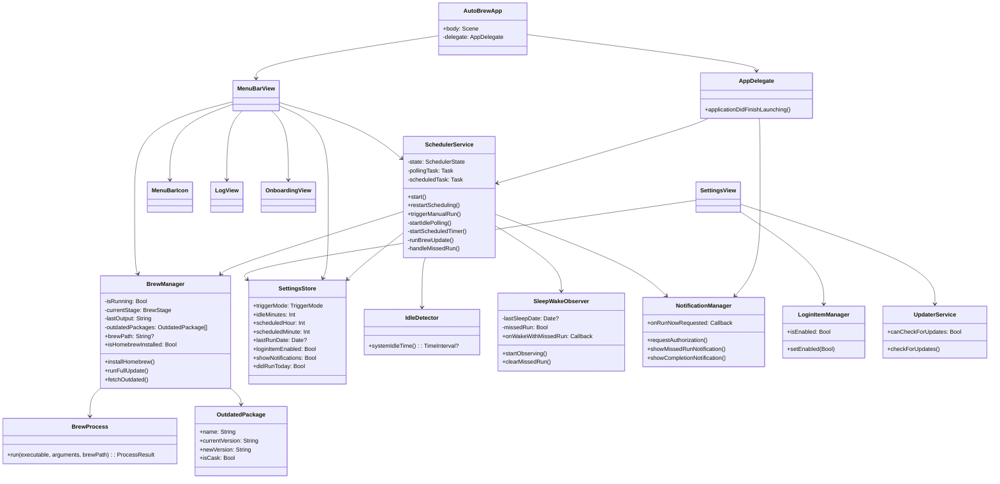
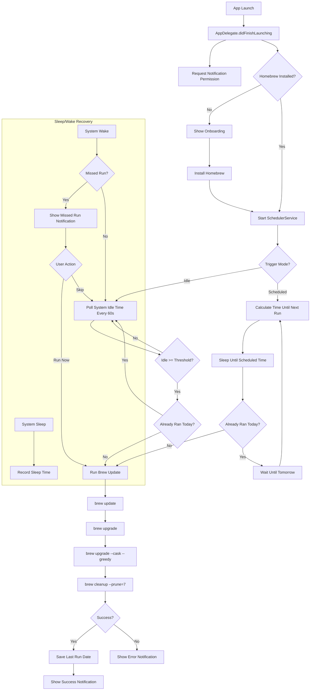
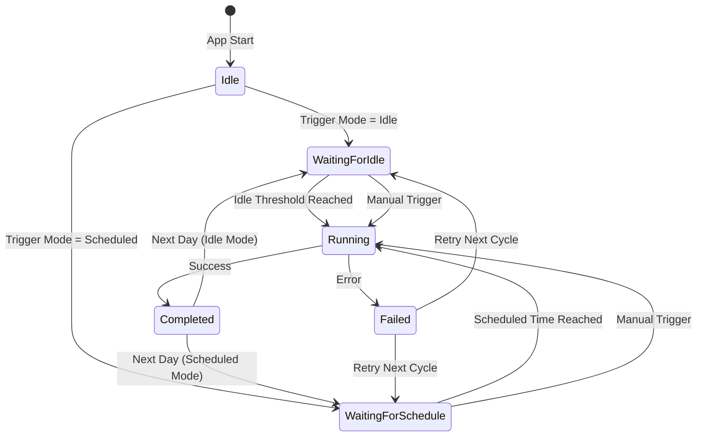

# AutoBrew

A native macOS menu bar app that automatically keeps Homebrew and all installed packages up to date — silently, in the background.

## Features

- **Automatic Updates** — Runs `brew update → brew upgrade → brew upgrade --cask --greedy → brew cleanup` once daily
- **Idle-Based Trigger** — Waits for configurable idle time before running (default: 30 min)
- **Scheduled Trigger** — Alternatively, run at a fixed time of day
- **Works While Locked** — Uses IOKit idle detection, independent of screen lock state
- **Missed Run Recovery** — If the Mac was asleep during a scheduled run, prompts the user on wake
- **Outdated Package List** — Shows outdated formulae and casks with current and available versions
- **Homebrew Auto-Install** — Installs Homebrew automatically if not present (guided onboarding)
- **Login Item** — Starts automatically with the system via SMAppService
- **Auto-Updates** — Keeps itself up to date via Sparkle
- **8 Languages** — English, German, French, Italian, Dutch, Polish, Portuguese (Brazil), Spanish

## BrewStation Integration

Starting with version 2.0.0, AutoBrew ships a full Homebrew GUI and an AppSnapshot engine.

### Browse
Full Homebrew cask catalog (`formulae.brew.sh`) with search, Top-100 list based on install statistics, and a direct-install button.

### Installed
List of all third-party apps in the `/Applications` folder with cask-token mapping. Per app: create snapshot, upgrade via Brew, or uninstall.

### Snapshots
Capture complete app state: `Library/Preferences`, `Library/Application Support`, `Library/Containers`, `Library/Saved Application State`, `Library/Group Containers`, `Library/Caches`. Stored under `~/Library/Application Support/AutoBrew/Snapshots/`. Restore with optional app quit.

### Cross-Mac Migration
- **Export a single snapshot** as an `.autobrewsnapshot` file (ZIP bundle with JSON manifest containing SHA-256 component hashes).
- **Bulk export** all snapshots as an `.autobrewbundle` directory with `restore_list.json`.
- **Restore wizard**: open a file or bundle, pick the apps to restore, automatically install missing casks via Homebrew (with search fallback for renamed casks), and replay the data.

### URL Scheme
- `autobrew://open` — open the main window.
- `autobrew://install/<cask-token>` — install a cask in the background (token validated against `[a-zA-Z0-9][a-zA-Z0-9._-]*`).

### Auto-Cleanup
In Settings: automatically remove old snapshots after N days (default 90). Cleanup runs after each successful Brew update.

## Install

### Via Homebrew (recommended)

```bash
brew tap marcelrgberger/tap
brew install --cask autobrew
```

### Manual Download

Download the latest DMG from [GitHub Releases](https://github.com/marcelrgberger/auto-brew/releases), open it, and drag AutoBrew to your Applications folder.

The app is signed and notarized by Apple — no Gatekeeper warnings.

## Requirements

- macOS 26.0+
- Xcode 26+
- Swift 6.0
- [XcodeGen](https://github.com/yonaskolb/XcodeGen)

## Setup

```bash
# Generate Xcode project
xcodegen generate

# Build
xcodebuild build -scheme AutoBrew -destination 'platform=macOS'

# Run tests
xcodebuild test -scheme AutoBrew -destination 'platform=macOS'
```

## Architecture

### Class Diagram



### Application Flow



### State Machine



## Project Structure

```
auto-brew/
├── project.yml                          # XcodeGen project definition
├── appcast.xml                          # Sparkle update feed
├── AutoBrew/
│   ├── Info.plist                       # App metadata (LSUIElement = true)
│   ├── AutoBrew.entitlements            # Empty (no sandbox)
│   ├── Assets.xcassets                  # App icon
│   └── Localizable.xcstrings            # Localization (8 languages)
├── Sources/
│   ├── App/
│   │   ├── AutoBrewApp.swift            # @main entry point with MenuBarExtra
│   │   └── AppDelegate.swift            # Lifecycle, activation policy
│   ├── Models/
│   │   ├── TriggerMode.swift            # .idle / .scheduled
│   │   ├── BrewStage.swift              # Update pipeline stages
│   │   ├── BrewError.swift              # Typed errors
│   │   ├── ProcessResult.swift          # Shell command result
│   │   ├── SchedulerState.swift         # State machine states
│   │   └── OutdatedPackage.swift        # Outdated formula/cask model
│   ├── Services/
│   │   ├── BrewManager.swift            # Homebrew detection + execution
│   │   ├── BrewProcess.swift            # Process wrapper (async/await, 600s timeout)
│   │   ├── SchedulerService.swift       # Central orchestrator
│   │   ├── IdleDetector.swift           # IOKit idle time
│   │   ├── SleepWakeObserver.swift      # NSWorkspace sleep/wake
│   │   ├── LoginItemManager.swift       # SMAppService wrapper
│   │   ├── NotificationManager.swift    # UNUserNotificationCenter
│   │   └── UpdaterService.swift         # Sparkle SPUUpdater wrapper
│   ├── ViewModels/
│   │   └── SettingsStore.swift          # UserDefaults bridge
│   ├── Views/
│   │   ├── MenuBarView.swift            # Menu bar popover
│   │   ├── MenuBarIcon.swift            # Dynamic menu bar icon with state badge
│   │   ├── SettingsView.swift           # Settings panel
│   │   ├── OnboardingView.swift         # First-launch Homebrew setup wizard
│   │   └── LogView.swift                # Brew command output viewer
│   └── Utilities/
│       └── AppLogger.swift              # Unified os.Logger
└── Tests/
    ├── BrewManagerTests.swift
    ├── IdleDetectorTests.swift
    └── SettingsStoreTests.swift
```

## Support

If you find AutoBrew useful, consider [sponsoring the project](https://github.com/sponsors/marcelrgberger).

## License

MIT License — see [LICENSE](LICENSE) for details.

Copyright 2026 Marcel R. G. Berger.
