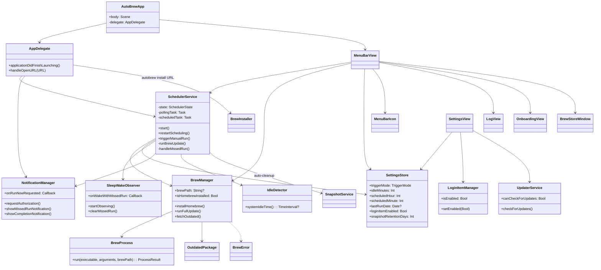
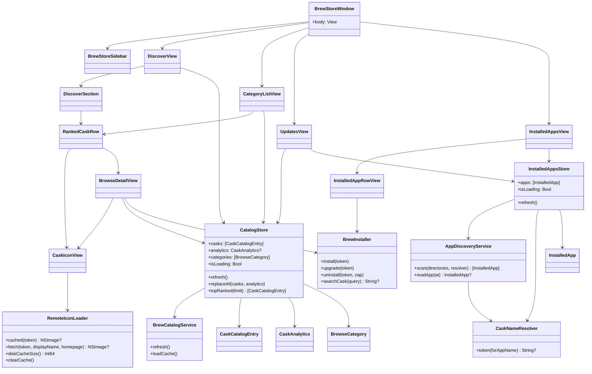
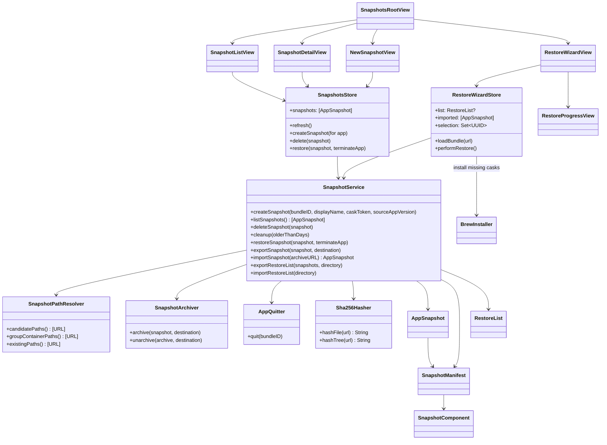
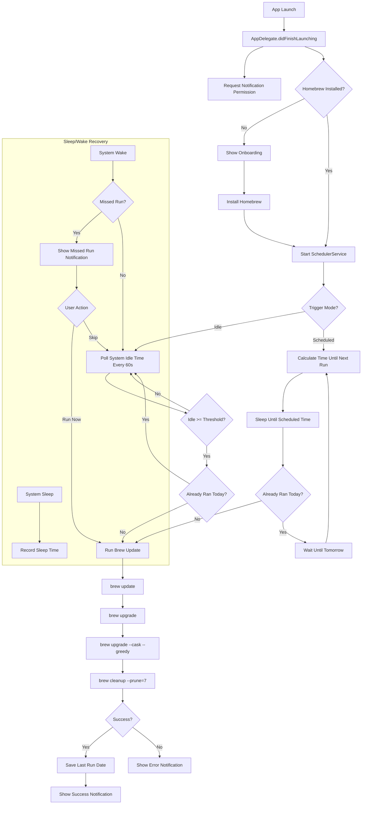
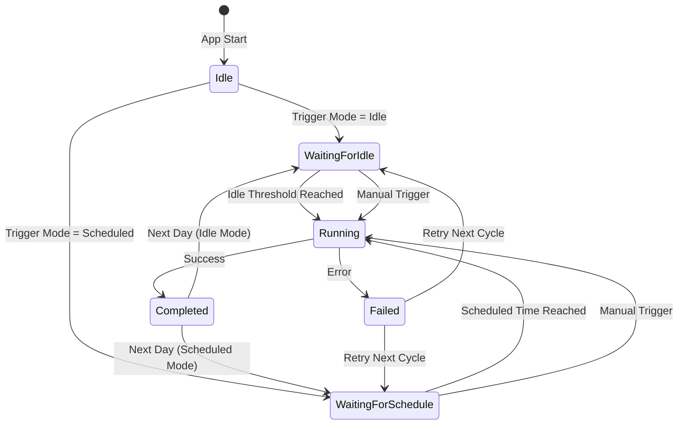

# AutoBrew

A native macOS menu bar app that automatically keeps Homebrew and all installed packages up to date — silently, in the background.

## Features

- **Automatic Updates** — Runs `brew update → brew upgrade → brew upgrade --cask --greedy → brew cleanup` once daily
- **Idle-Based Trigger** — Waits for configurable idle time before running (default: 30 min)
- **Scheduled Trigger** — Alternatively, run at a fixed time of day
- **Works While Locked** — Uses IOKit idle detection, independent of screen lock state
- **Missed Run Recovery** — If the Mac was asleep during a scheduled run, prompts the user on wake
- **Outdated Package List** — Shows outdated formulae and casks with current and available versions
- **Homebrew Auto-Install** — Installs Homebrew automatically if not present (guided onboarding)
- **Login Item** — Starts automatically with the system via SMAppService
- **Auto-Updates** — Keeps itself up to date via Sparkle
- **8 Languages** — English, German, French, Italian, Dutch, Polish, Portuguese (Brazil), Spanish

## BrewStore

Starting with version 2.0.0, AutoBrew ships a full Homebrew GUI and an AppSnapshot engine.

### Browse
Full Homebrew cask catalog (`formulae.brew.sh`) with search, Top-100 list based on install statistics, and a direct-install button.

### Installed
List of all third-party apps in the `/Applications` folder with cask-token mapping. Per app: create snapshot, upgrade via Brew, or uninstall.

### Snapshots
Capture complete app state: `Library/Preferences`, `Library/Application Support`, `Library/Containers`, `Library/Saved Application State`, `Library/Group Containers`, `Library/Caches`. Stored under `~/Library/Application Support/AutoBrew/Snapshots/`. Restore with optional app quit.

### Cross-Mac Migration
- **Export a single snapshot** as an `.autobrewsnapshot` file (ZIP bundle with JSON manifest containing SHA-256 component hashes).
- **Bulk export** all snapshots as an `.autobrewbundle` directory with `restore_list.json`.
- **Restore wizard**: open a file or bundle, pick the apps to restore, automatically install missing casks via Homebrew (with search fallback for renamed casks), and replay the data.

### URL Scheme
- `autobrew://open` — open the main window.
- `autobrew://install/<cask-token>` — install a cask in the background (token validated against `[a-zA-Z0-9][a-zA-Z0-9._-]*`).

### Auto-Cleanup
In Settings: automatically remove old snapshots after N days (default 90). Cleanup runs after each successful Brew update.

## Install

### Via Homebrew (recommended)

```bash
brew tap marcelrgberger/tap
brew install --cask autobrew
```

### Manual Download

Download the latest DMG from [GitHub Releases](https://github.com/marcelrgberger/auto-brew/releases), open it, and drag AutoBrew to your Applications folder.

The app is signed and notarized by Apple — no Gatekeeper warnings.

## Requirements

- macOS 26.0+
- Xcode 26+
- Swift 6.0
- [XcodeGen](https://github.com/yonaskolb/XcodeGen)

## Setup

```bash
# Generate Xcode project
xcodegen generate

# Build
xcodebuild build -scheme AutoBrew -destination 'platform=macOS'

# Run tests
xcodebuild test -scheme AutoBrew -destination 'platform=macOS'
```

## Architecture

AutoBrew is structured around three responsibilities — the auto-update engine (menu bar lifecycle, scheduling, Brew execution), the BrewStore browse/install surface (catalog, installed apps, casks), and the AppSnapshot subsystem (capture, restore, cross-Mac migration). Each is shown as its own class diagram below.

### Diagram 1 — App Lifecycle & Auto-Update Engine



### Diagram 2 — BrewStore: Browse, Install, Manage



### Diagram 3 — AppSnapshot Engine & Cross-Mac Restore



### Application Flow



### State Machine



## Project Structure

```
auto-brew/
├── project.yml                          # XcodeGen project definition
├── appcast.xml                          # Sparkle update feed
├── AutoBrew/                            # Bundle resources
│   ├── Info.plist                       # LSUIElement = true, autobrew:// URL scheme
│   ├── AutoBrew.entitlements            # No sandbox (direct distribution)
│   ├── Assets.xcassets                  # App icon
│   ├── Localizable.xcstrings            # 8-language string catalog
│   └── {en,de,fr,it,nl,pl,pt-BR,es}.lproj/InfoPlist.strings
├── Sources/
│   ├── App/                             # Entry point
│   │   ├── AutoBrewApp.swift            # @main, MenuBarExtra scene
│   │   └── AppDelegate.swift            # Lifecycle, autobrew:// URL handler
│   ├── Models/                          # Plain value types (Codable, Sendable)
│   │   ├── BrewError.swift, BrewStage.swift, OutdatedPackage.swift,
│   │   ├── ProcessResult.swift, SchedulerState.swift, TriggerMode.swift
│   │   ├── CaskCatalogEntry.swift       # formulae.brew.sh entry
│   │   ├── CaskAnalytics.swift          # 30-day install counts
│   │   ├── InstalledApp.swift           # /Applications scan result
│   │   ├── BrowseCategory.swift         # Discover-section taxonomy
│   │   ├── AppSnapshot.swift, SnapshotComponent.swift, SnapshotManifest.swift
│   │   └── RestoreList.swift            # Cross-Mac bundle index
│   ├── Services/                        # Stateful logic (@MainActor or Sendable)
│   │   ├── BrewProcess.swift, BrewManager.swift, SchedulerService.swift
│   │   ├── IdleDetector.swift, SleepWakeObserver.swift,
│   │   ├── NotificationManager.swift, LoginItemManager.swift, UpdaterService.swift
│   │   ├── BrewCatalogService.swift     # Catalog + analytics download/cache
│   │   ├── BrewInstaller.swift          # install / upgrade / uninstall / search
│   │   ├── AppDiscoveryService.swift    # /Applications scanner
│   │   ├── CaskNameResolver.swift       # App name -> cask token mapping
│   │   ├── SnapshotService.swift        # Create / list / restore / export / import
│   │   ├── SnapshotArchiver.swift       # ZIP bundle + manifest validation
│   │   ├── SnapshotPathResolver.swift   # Per-bundle-id Library paths
│   │   ├── AppQuitter.swift             # Quit before restore
│   │   └── RemoteIconLoader.swift       # Cask icon fetch + on-disk cache
│   ├── ViewModels/                      # @Observable @MainActor stores
│   │   ├── SettingsStore.swift          # UserDefaults bridge
│   │   ├── CatalogStore.swift           # BrewStore browse/discover state
│   │   ├── InstalledAppsStore.swift     # Installed apps + cask matching
│   │   ├── SnapshotsStore.swift         # Snapshot list + operations
│   │   └── RestoreWizardStore.swift     # Cross-Mac restore flow
│   ├── Views/                           # SwiftUI views
│   │   ├── MenuBarView.swift, MenuBarIcon.swift, SettingsView.swift
│   │   ├── LogView.swift, OnboardingView.swift
│   │   ├── BrewStoreWindow.swift        # Root window for BrewStore
│   │   ├── BrewStore/                   # Sidebar + sections
│   │   │   ├── BrewStoreSidebar.swift, DiscoverView.swift, DiscoverSection.swift
│   │   │   ├── RankedCaskRow.swift, CategoryListView.swift, UpdatesView.swift
│   │   ├── Browse/                      # Cask detail
│   │   │   ├── BrowseDetailView.swift, CaskIconView.swift
│   │   ├── Installed/
│   │   │   ├── InstalledAppsView.swift, InstalledAppRowView.swift
│   │   ├── Snapshots/
│   │   │   ├── SnapshotsRootView.swift, SnapshotListView.swift,
│   │   │   ├── SnapshotDetailView.swift, NewSnapshotView.swift
│   │   └── Restore/
│   │       ├── RestoreWizardView.swift, RestoreProgressView.swift
│   └── Utilities/                       # Pure helpers
│       ├── AppLogger.swift              # Unified os.Logger
│       ├── AppleAppFilter.swift         # Drop Apple-bundled apps from discovery
│       ├── Sha256Hasher.swift           # File + length-prefixed tree hashes
│       ├── ByteFormatter.swift          # Human-readable sizes
│       └── NSPanelAsync.swift           # async/await wrapper around NSOpenPanel
└── Tests/                               # XCTest (54 tests)
    ├── Models:   CaskCatalogEntryTests, RestoreListTests, BrowseCategoryTests
    ├── Services: BrewCatalogServiceTests, AppDiscoveryServiceTests,
    │             CaskNameResolverTests, SnapshotServiceTests,
    │             SnapshotArchiverTests, SnapshotPathResolverTests,
    │             BrewManagerTests, IdleDetectorTests
    ├── ViewModels: CatalogStoreTests, SettingsStoreTests
    └── Utilities: AppleAppFilterTests, Sha256HasherTests
```

## Tests

XCTest covers the model layer, services, view-models, and utilities — currently **54 tests** across 15 files:

| Layer | Suites |
|---|---|
| Models | `CaskCatalogEntryTests`, `RestoreListTests`, `BrowseCategoryTests` |
| Services | `BrewCatalogServiceTests`, `AppDiscoveryServiceTests`, `CaskNameResolverTests`, `SnapshotServiceTests`, `SnapshotArchiverTests`, `SnapshotPathResolverTests`, `BrewManagerTests`, `IdleDetectorTests` |
| ViewModels | `CatalogStoreTests`, `SettingsStoreTests` |
| Utilities | `AppleAppFilterTests`, `Sha256HasherTests` |

Run with:

```bash
xcodebuild test -scheme AutoBrew -destination 'platform=macOS'
```

## Security & Data Integrity

The AppSnapshot engine handles arbitrary user data. AutoBrew implements:

- **Path-traversal protection**: snapshot restore validates every path stays inside `$HOME`; archive extraction rejects symlinks and absolute paths; bundle IDs validated against `^[a-zA-Z0-9][a-zA-Z0-9._-]*$`.
- **Hash verification**: every snapshot file has a SHA-256 hash; every directory has a tree hash using length-prefixed binary framing. Mismatch aborts the restore before any data is overwritten.
- **Transactional restore**: two-phase commit — all existing destinations are moved to backups first, then copies happen, then backups are removed. Failure at any step rolls back atomically.
- **TOCTOU protection**: hashes are re-verified after copy.
- **URL-scheme CSRF**: `autobrew://install/<token>` opens an `NSAlert` requiring user confirmation; token regex blocks flag injection (`--cask`, etc.).
- **Process isolation**: `brew` invocations use a lock-protected `Process` wrapper to prevent race conditions; respects parent task cancellation.
- **Schema versioning**: imports reject unsupported schema versions.
- **Saturating arithmetic**: cumulative file sizes use overflow-reporting addition to prevent Int64 wrap.

## Support

If you find AutoBrew useful, consider [sponsoring the project](https://github.com/sponsors/marcelrgberger).

## License

MIT License — see [LICENSE](LICENSE) for details.

Copyright 2026 Marcel R. G. Berger.
