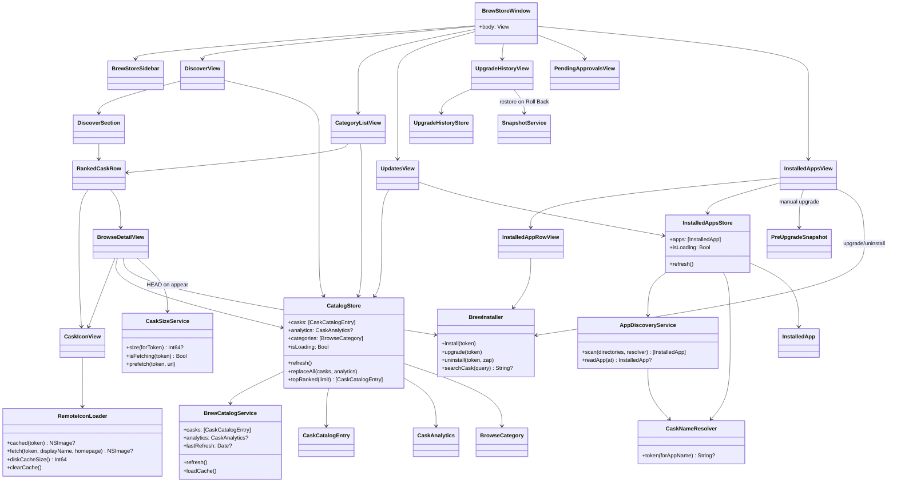
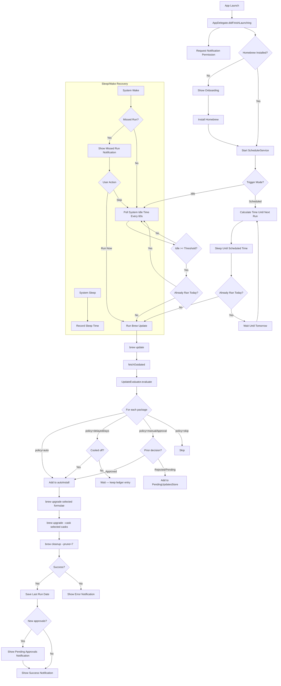
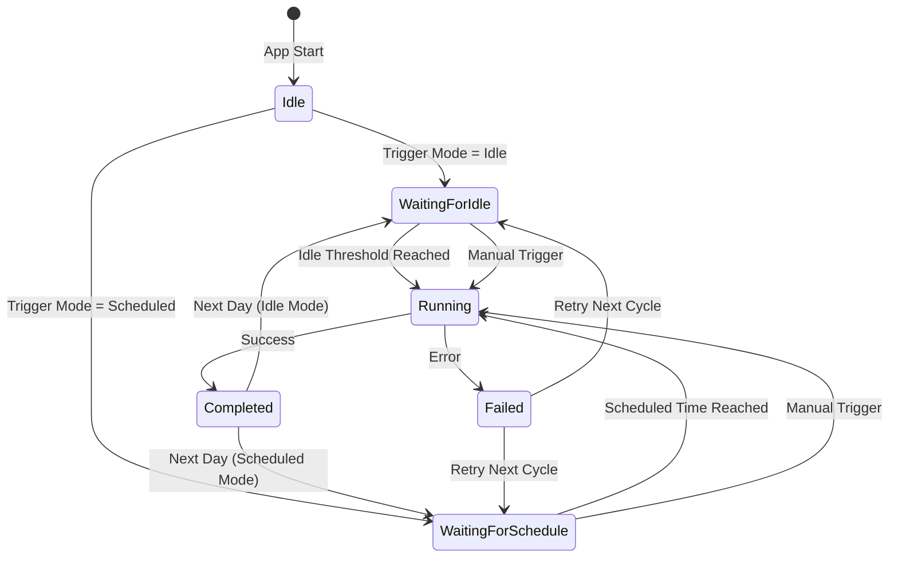

# AutoBrew

A native macOS menu bar app that automatically keeps Homebrew and all installed packages up to date — silently, in the background.

> **Safe by design.** When you install AutoBrew via the official channels — the DMG from [GitHub Releases](https://github.com/marcelrgberger/auto-brew/releases) or `brew install --cask autobrew` from the Homebrew tap — every release is built with Apple's Developer ID certificate, notarized by Apple, and stapled before it ships. macOS Gatekeeper accepts AutoBrew without warnings. The auto-update channel is signed with an EdDSA Ed25519 key — AutoBrew refuses to install an update whose signature doesn't verify. Source is open under the MIT License, no telemetry, no AutoBrew backend, no account — everything runs locally on your Mac.

## Install — Homebrew (recommended)

```bash
brew tap marcelrgberger/tap
brew install --cask autobrew
```

Other ways to install (manual DMG, requirements) are covered in the [Install](#install) section below. The cask submission to the official [`Homebrew/homebrew-cask`](https://github.com/Homebrew/homebrew-cask) catalog is prepared under [`docs/homebrew-cask-submission/`](docs/homebrew-cask-submission/SUBMISSION.md) — once merged upstream, the recommended install reduces to `brew install --cask autobrew` without the `brew tap …` line.

Release notes for every version live in [CHANGELOG.md](CHANGELOG.md) — the same body is shown in Sparkle's update dialog and on the GitHub release page.

## Table of Contents

- [Features](#features)
- [Quick Start](#quick-start)
- [User Guide](#user-guide)
  - [First Launch](#first-launch)
  - [Choosing an Update Trigger](#choosing-an-update-trigger)
  - [Configuring the Update Policy](#configuring-the-update-policy)
  - [Pending Approvals](#pending-approvals-workflow)
  - [Browsing & Installing Casks](#browsing--installing-casks)
  - [Searching the Catalog](#searching-the-catalog)
  - [Managing Installed Apps](#managing-installed-apps)
  - [Creating an App Snapshot](#creating-an-app-snapshot)
  - [Restoring a Snapshot](#restoring-a-snapshot)
  - [Automatic Pre-Upgrade Snapshots](#automatic-pre-upgrade-snapshots)
  - [Update History & One-Click Rollback](#update-history--one-click-rollback)
  - [Collections](#collections)
  - [Shortcuts, Siri and Spotlight](#shortcuts-siri-and-spotlight)
  - [`autobrew` CLI](#autobrew-cli)
  - [Desktop & Notification-Center Widget](#desktop--notification-center-widget)
  - [Migrating to Another Mac](#migrating-to-another-mac)
  - [URL Scheme & Deep Links](#url-scheme--deep-links)
  - [Notifications](#notifications)
  - [Languages](#languages)
- [BrewStore](#brewstore)
  - [Discover & Browse](#discover--browse)
  - [Global Search](#global-search)
  - [Installed](#installed)
  - [Snapshots](#snapshots)
  - [Update History](#update-history)
- [Selective Update Policy](#selective-update-policy)
  - [Defaults](#defaults)
  - [Per-Package Overrides](#per-package-overrides)
  - [Pending Approvals](#pending-approvals)
  - [Cool-off Tracking](#cool-off-tracking)
- [Install](#install)
- [Requirements](#requirements)
- [Setup (Developers)](#setup-developers)
- [CI / Release Pipeline](#ci--release-pipeline)
- [Architecture](#architecture)
- [Project Structure](#project-structure)
- [Tests](#tests)
- [Security & Data Integrity](#security--data-integrity)
- [Support](#support)
- [License](#license)

## Features

- **Automatic Updates** — Runs `brew update → policy gate → selective brew upgrade → brew cleanup` once daily
- **Selective Update Policy** — Per-bump-type and per-package rules: patches roll out fast, minors wait a configurable cool-off, majors require explicit approval
- **Pre-Upgrade Auto-Snapshots** — Before every auto-installed cask upgrade, AutoBrew snapshots the app's user data so a broken update can be rolled back with one click from the new History view
- **Shortcuts, Siri and Spotlight** — Install Cask / Snapshot App / Roll Back Last Upgrade actions via the system AppIntents framework
- **Desktop & Notification-Center Widget** — Status widget in three sizes (Small / Medium / Large) with pending-approval count, recent upgrade outcomes and a one-tap roll back for the latest failed cask
- **In-App Legal Section** — Privacy, Terms, EULA, Imprint, Trademark, Open-Source licenses — localized into all supported languages
- **Idle-Based Trigger** — Waits for configurable idle time before running (default: 30 min)
- **Scheduled Trigger** — Alternatively, run at a fixed time of day
- **Works While Locked** — Uses IOKit idle detection, independent of screen lock state
- **Missed Run Recovery** — If the Mac was asleep during a scheduled run, prompts the user on wake
- **Outdated Package List** — Shows outdated formulae and casks with current and available versions
- **Homebrew Auto-Install** — Installs Homebrew automatically if not present (guided onboarding)
- **Login Item** — Starts automatically with the system via SMAppService
- **Auto-Updates** — Keeps itself up to date via Sparkle
- **8 Languages** — English, German, French, Italian, Dutch, Polish, Portuguese (Brazil), Spanish

## Quick Start

1. Install AutoBrew via Homebrew: `brew tap marcelrgberger/tap && brew install --cask autobrew`
2. Launch AutoBrew once from `/Applications`. The mug icon appears in the menu bar.
3. If Homebrew isn't on your Mac yet, the onboarding screen installs it for you.
4. Grant the notification permission when prompted — it's how AutoBrew tells you when an update needs approval.
5. Click the menu-bar mug → **Settings…** to pick a trigger mode (Idle or Scheduled) and review the default update policy.
6. That's it — AutoBrew runs in the background. Open it any time from the menu bar to inspect outdated packages, browse the BrewStore, or review pending approvals.

## User Guide

A walkthrough of every feature, in the order you'd typically encounter them.

### First Launch

When AutoBrew starts for the first time it runs an onboarding flow:

1. **Notification permission** — AutoBrew uses local notifications for missed-run reminders and pending-approval alerts. Allow them; they're never sent over a network.
2. **Homebrew detection** — if `brew` is missing, the onboarding offers to run the official installer (`/bin/bash -c "$(curl -fsSL https://raw.githubusercontent.com/Homebrew/install/HEAD/install.sh)"`). Install requires admin password (sudo) — same as a manual Homebrew install.
3. **Launch at login** — opt-in checkbox. Wires up `SMAppService` so AutoBrew restarts automatically with macOS.

Onboarding only runs once. To re-trigger it manually, remove `~/Library/Preferences/za.co.digitalfreedom.AutoBrew.plist` and relaunch.

### Choosing an Update Trigger

Settings → **Update Trigger** picks how AutoBrew decides to run:

- **Idle mode** (default) — polls system idle time every 60 s and starts a Brew run after the user has been idle for at least `N` minutes (configurable, default 30). Runs at most once per calendar day. Idle detection reads `HIDIdleTime` from `IOHIDSystem` via IOKit, so it works even while the screen is locked.
- **Scheduled mode** — runs at a fixed time of day (configurable). If the Mac was asleep at the scheduled time, AutoBrew triggers a missed-run notification on wake instead of silently skipping.

Switch between modes at any time. The scheduler restarts cleanly when you do.

### Configuring the Update Policy

Settings → **Update Policy** has six pickers (patch / minor / major × Casks / Formulae) plus per-package overrides. Each picker accepts one of four policies:

| Policy | Behaviour |
|---|---|
| **Auto** | Install on the next scheduled run. |
| **Wait N days** | Install only after the new version has been visible for at least `N` days. Cool-off resets when a newer version supersedes the pending one. |
| **Ask me** | Don't install — surface the update in the Pending Approvals section instead. |
| **Skip** | Never install for this bump type. |

The default profile is conservative: patches roll out quickly, minors get a cool-off window, majors always wait for the user. Defaults differ between Casks and Formulae because Formulae carry security patches more often.

For one specific package, open it in the BrewStore detail view and click **Update Policy**. The override sheet lets you set patch/minor/major independently; leaving a row on **Default** inherits the global setting. The same sheet also carries an optional **Pre-snapshot command** (`/bin/bash -c <command>`, 30 s timeout) that runs right before the pre-upgrade snapshot of this cask — handy for flushing in-memory app state (`osascript`-driven saves, daemon quits, etc.). The command runs with your user permissions; the UI carries a clear warning that you should only paste commands you can read end-to-end.

### Pending Approvals Workflow

Major updates (and anything where the version string isn't parseable enough to classify) land in the **Pending Approvals** queue:

1. AutoBrew detects the update during a Brew run.
2. The menu-bar icon grows a small orange dot.
3. A notification fires once per new entry (`X updates need approval (Package A, B, …)`).
4. Click **Review** on the notification, or open BrewStore → **Pending Approvals**.
5. Per row: **Approve** (queues for the next run), **Reject** (sticky — won't ask again until a newer version arrives), or use the toolbar **Approve All** / **Reject All**.

Once approved entries actually install during the next scheduler run, they are removed from the queue automatically.

**Release notes inline.** When the cask's homepage points at a `github.com/<owner>/<repo>` repository, AutoBrew fetches the GitHub release notes for the incoming version and shows them as an expandable section directly under the row. The fetch goes through a per-cask disk cache with a 7-day TTL plus a fallback to `/releases/latest` when no version-tagged release exists, so the 60-req/hour unauthenticated GitHub limit is never the bottleneck. Decisions stop being blind.

### Browsing & Installing Casks

BrewStore → **Discover** shows App-Store-style sections (Top Ranked, plus categories like Browsers, Developer Tools, Productivity, …) sorted by 365-day install popularity from the public Homebrew analytics.

- Click any tile to see the cask's description, version, homepage, and the per-package Update Policy button.
- The detail view also shows the **download size** for the DMG by issuing a single HTTP HEAD against the cask URL when the view opens — a real number for most casks, "Download size unknown" when the server hides `Content-Length` or refuses HEAD. Sizes are cached in memory for the rest of the session so reopening the same detail view stays instant.
- Click **Install** to run `brew install --cask <token>` directly. The button label flips to **Open** once the app is on disk.
- Hover any row to see the full description (and the brew token for `@variant` casks).

### Searching the Catalog

The search field in the sidebar searches the **entire** cask catalog as soon as you type — across name, description, token, and the variant-decorated presentation name. The detail pane switches to a global Search Results view; clearing the field returns you to whichever section you were on. Results are sorted by install popularity so the most likely match floats to the top.

### Managing Installed Apps

BrewStore → **Installed** lists every `.app` in `/Applications` and `~/Applications` (Apple system apps filtered out). Each row shows the bundle ID, version, and — when applicable — the brew token managing the app.

How AutoBrew decides whether to show brew actions:

- It runs `brew info --cask --json=v2 --installed` once per refresh to learn what brew is **actually** tracking, including custom-tap installs.
- An app is marked as brew-managed only when the resolved token appears in that authoritative set. Manually installed apps stay unmanaged — no broken Upgrade/Uninstall buttons.

Per row (`⋯` menu):

- **Take Snapshot** — always available.
- **Upgrade via Brew** / **Uninstall via Brew** — only when brew is tracking the cask.

### Creating an App Snapshot

A snapshot is a point-in-time copy of everything an application owns outside its `.app` bundle. Use one before a risky upgrade, before migrating to a new Mac, or before deleting an app you might miss.

1. BrewStore → **Snapshots** → **New Snapshot** (or use the `⋯` menu of an Installed app).
2. Pick the app to snapshot. AutoBrew offers to quit it first — answer **Yes** unless you're sure the app isn't writing to disk.
3. AutoBrew copies every readable user-data folder for the app (preferences, application support, containers, group containers, saved state, caches), hashes each component with SHA-256, and writes a `manifest.json` next to the components. Files macOS refuses to hand over (e.g. `.com.apple.containermanagerd.metadata.plist` inside `Library/Containers/`) are silently skipped so a single locked-down sibling can't kill the whole snapshot; non-permission I/O errors still abort.
4. The snapshot appears in the Snapshots list with the timestamp and size.

To free disk space later, either delete individual snapshots in the Snapshots view or enable Settings → **Auto-clean up old snapshots** with a retention window (default 90 days).

**External storage.** Settings → Snapshots → **External storage** opens a folder picker that points the snapshot root at a user-chosen location — typically an external drive or NAS mount. AutoBrew stores the choice as a security-scoped bookmark so the same folder is found again after unplug/replug; if the volume isn't mounted at app launch, it silently falls back to the default `~/Library/Application Support/AutoBrew/Snapshots/`.

### Restoring a Snapshot

1. Open the snapshot in the Snapshots view.
2. Click **Restore**.
3. AutoBrew re-verifies every component hash before touching disk; mismatch → restore aborts.
4. The currently installed user-data is renamed to `.autobrew-rollback-<uuid>` (atomic on the same volume). If anything goes wrong after, that rollback copy is moved back into place.
5. The snapshot content is copied into the target paths.
6. Hashes are recomputed on the written files. A second mismatch triggers the rollback path.
7. On success the temporary rollback siblings are removed.

The whole restore is transactional — there is no partial state. You can opt out of the "quit the app first" step, but that risks data corruption if the app is mid-write.

### Automatic Pre-Upgrade Snapshots

Whenever AutoBrew auto-installs a cask upgrade (the **Auto** policy bucket — patches by default, anything else once its cool-off elapses), it can snapshot the cask's user data right before `brew` rewrites the `.app`. If the upgrade breaks your settings, you roll back in one click from the History view.

The toggle is in Settings → Snapshots → **Snapshot apps before auto-upgrade** and is on by default. Turn it off if you'd rather spare the disk space than keep the rollback affordance.

Per cask in the auto-install bucket:

1. AutoBrew resolves the cask token to a bundle ID via the same Installed Apps reconciliation BrewStore uses (catalog appName lookup, cross-checked against `brew info --cask --json=v2 --installed`).
2. `SnapshotService.createSnapshot` runs against that bundle's user-data folders before `brew upgrade` is invoked.
3. A new row is appended to `~/Library/Application Support/AutoBrew/UpgradeHistory.json` with the cask, the from/to versions, and the snapshot's UUID.

Failures never block the upgrade. CLI-only casks, apps that don't live in `/Applications`/`~/Applications`, or permission-denied components all produce a History row **without** a snapshot ID — the audit trail stays complete, just without a rollback button on that row. The snapshot itself follows the normal storage and retention rules, so the auto-cleanup window prunes it like any other snapshot.

**Disk-pressure awareness.** When the home-directory volume has less than the configured threshold (default 10 GiB) free, AutoBrew skips the pre-upgrade snapshot for that cask and surfaces a notification telling you which cask and why. The upgrade still runs — better than risking a near-full disk and breaking unrelated apps. Tune the threshold in Settings → Snapshots.

### Update History & One-Click Rollback

BrewStore → **History** lists every cask AutoBrew has auto-upgraded, newest first, with the from/to versions, when it ran, and a per-cask status icon — green check for casks brew confirmed upgraded, red cross for casks that emitted an explicit `Error:` line during their upgrade, and an orange question mark when brew completed but did not emit either marker for that particular cask (the snapshot and rollback are still valid in that case). The per-cask attribution comes from a dedicated parser of `brew upgrade --cask`'s output so an aggregate brew exit status no longer paints every cask in a batch with the same brush.

When the pre-upgrade snapshot still exists on disk, a **Roll Back** button appears next to the row:

1. Click **Roll Back**.
2. A sheet opens with the snapshot's components (Preferences, Containers, Application Support, Caches, Saved State, Group Containers) listed as checkboxes with their sizes. Untick anything you want to leave at its current live state — handy when you only want to revert Preferences without flattening the Cache. The default is "everything selected" so a hit on **Roll Back** without unticking matches the old all-or-nothing behaviour.
3. AutoBrew quits the app, then restores the selected components from the snapshot — the upgraded `.app` binary itself **stays in place**, only the selected user-data folders revert.
4. The restore runs through the same transactional path described in [Restoring a Snapshot](#restoring-a-snapshot), so a failure mid-way rolls every selected component back.

If a row says **Snapshot pruned** instead, the snapshot was removed by retention (or by you in the Snapshots view) and the History row is now audit-only. The row itself never disappears just because the snapshot did — the history of what was auto-upgraded is kept indefinitely.

**Rolling back straight from a failed-update notification.** When an auto-update run fails *and* the most recent failed cask still has a live pre-upgrade snapshot, the failure notification carries an extra **Roll Back** action. Tapping it runs the same restore the History view would, without needing to open AutoBrew first.

**Manual upgrades from BrewStore.** The same snapshot-then-upgrade-then-record pipeline now runs when you press **Upgrade via Brew** on a row in Installed, so manually-initiated upgrades also produce a History entry with a rollback affordance. A per-token in-flight guard rejects double-clicks so two snapshot+upgrade tasks can never race for the Homebrew lock.

### Migrating to Another Mac

Two flavours:

- **Single-app**: Snapshot detail → **Export…** writes a self-contained `.autobrewsnapshot` file (ZIP archive built with `ditto -c -k --sequesterRsrc` to preserve macOS extended attributes). Drop it onto the target Mac and double-click to import.
- **Bulk**: Snapshots view → **Export All…** produces an `.autobrewbundle` directory with one `.autobrewsnapshot` per app plus a `restore_list.json` index. Copy the whole directory.

On the new Mac open the **Restore Wizard** (Snapshots → Import…), point it at the `.autobrewsnapshot` or `.autobrewbundle`, pick which apps to restore, and AutoBrew:

1. Validates the manifest (non-empty bundle IDs, ≥ 1 component, hashes well-formed, no zip-slip in the archive).
2. Installs missing casks via `brew install --cask <token>`; if the cask was renamed since the snapshot, `brew search` finds the new token automatically.
3. Restores each app via the same transactional flow as a local restore.

### Collections

BrewStore → **Collections** lets you define named sets of cask tokens — *Dev Setup*, *Gaming Setup*, *New Laptop* — and act on the whole set with one click.

- **Create** a collection from the sidebar's **+** button, give it a name, and add tokens individually in the detail view. Token grammar is validated against `^[a-zA-Z0-9][a-zA-Z0-9._-]*$` to keep typos out.
- **Install All** runs `brew install --cask` for every token in sequence, with a progress banner that tracks `<done>/<total>` and the cask currently being processed. A failure inside the batch doesn't abort the rest — failed tokens get collected and shown in an error alert after the run completes.
- **Uninstall All** does the same with `brew uninstall --cask`.
- **Export…** writes the collection as a single `.autobrewcollection` JSON file (Save panel from the row's context menu). **Import…** from the sidebar's tray button reads one back and adds it with a fresh UUID so it can't clobber an existing collection.

Collections live in `~/Library/Application Support/AutoBrew/Collections.json` alongside the other AutoBrew state.

### Shortcuts, Siri and Spotlight

AutoBrew exposes three system AppIntents so the snapshot/upgrade/rollback pipeline shows up in **Shortcuts.app**, can be invoked from **Siri**, and surfaces in **Spotlight** alongside other system actions:

| Intent | Phrase / Title | What it does |
|---|---|---|
| **Install Cask** | "Install a cask with AutoBrew" | Takes a cask token and runs `brew install --cask <token>` through `BrewInstaller`, same retry-with-`--force` and lock semantics as the BrewStore button. |
| **Snapshot App Data** | "Snapshot an app with AutoBrew" | Takes a cask token, resolves it to a bundle ID via the Installed Apps reconciliation, and runs `SnapshotService.createSnapshot`. Returns the snapshot UUID so the user can chain it into another shortcut. |
| **Roll Back Last Cask Upgrade** | "Roll back the last upgrade with AutoBrew" | Walks the History store newest-first for a failed cask with a live snapshot and runs the same transactional restore as the History view. Optional cask-token parameter scopes the search to one cask. |

Tokens are validated against the same `^[a-zA-Z0-9][a-zA-Z0-9._-]*$` grammar the `autobrew://install/` URL scheme uses — defense in depth even though the cask token is never interpreted through a shell. Intents run with `openAppWhenRun = false` so a Shortcut from another app does not steal focus.

Known limitation: because AutoBrew sets `LSUIElement = true`, the system only discovers these intents after the menu-bar icon has been visible at least once. For users who already run AutoBrew that is automatic; brand-new installs need to launch the app once before the actions appear in Shortcuts.

### Desktop & Notification-Center Widget

AutoBrew ships a WidgetKit-based status widget. Add it from **System Settings → Desktop & Dock → Widgets**, or right-click the desktop and choose **Edit Widgets**, then drag the AutoBrew widget onto your desktop or into Notification Center.

| Size | What it shows | Tap behaviour |
|---|---|---|
| **Small** | Pending-approval count (or "Up to date"), updated-at footer. | Opens AutoBrew → Pending Approvals. |
| **Medium** | Pending count left + the three most recent auto-upgrade rows on the right (cask name, from→to, per-cask outcome icon). | Opens AutoBrew. |
| **Large** | Pending headline + the five most recent upgrades + a **Run Now** link plus a destructive **Roll Back Last Failed** link when a rollback candidate exists. | Run Now triggers an immediate `brew update → upgrade → cleanup` cycle in the host app (same reentrancy guard as the menu-bar manual-trigger). Roll Back uses the same restore path as the failed-upgrade notification. Surface tap opens AutoBrew. |

**Per-cask icons** match the History view: green check (brew confirmed the upgrade), red cross (brew emitted an error inside that cask's section), orange question mark ("outcome unclear — brew swallowed the per-cask signal but the snapshot and rollback are still valid").

**Where the data lives.** The widget reads from `~/Library/Group Containers/group.za.co.digitalfreedom.AutoBrew/WidgetState.json`, written by the main app whenever pending approvals or upgrade history mutate (plus once at the end of every scheduler run so the "Updated <relative>" footer stays honest even on a no-op day). The widget extension is sandboxed; the App Group container is its only window into the main app's data.

**First-launch caveat.** Because AutoBrew sets `LSUIElement = true`, the widget only appears in the Add Widget picker after the menu-bar icon has been visible at least once.

### `autobrew` CLI

A thin terminal helper ships inside the app bundle at
`AutoBrew.app/Contents/Helpers/autobrew` and is symlinked into the
user's `PATH` by the Homebrew cask. It routes every command through
the existing `autobrew://` URL scheme — AutoBrew must be installed
and running for the commands to take effect, and the security checks
the URL handler enforces (cask-token grammar, NSAlert confirmation
on install) apply unchanged.

```bash
autobrew open                    # bring BrewStore forward
autobrew install firefox         # request an install, NSAlert confirms
autobrew rollback                # roll back the most recent failed cask
autobrew run-now                 # trigger an immediate update + upgrade
autobrew version                 # print bundled version
```

Direct service reuse (running snapshot creation from the CLI without
involving the GUI) is out of scope for this first iteration — it
would need its own event loop and file locking against the GUI's
`@MainActor` stores. The URL-relay design keeps the GUI as the
single writer to all on-disk state.

### URL Scheme & Deep Links

AutoBrew registers the `autobrew://` URL scheme:

- `autobrew://open` — bring the BrewStore window forward (works from Terminal, a browser link, or another app's automation).
- `autobrew://install/<cask-token>` — install a cask in the background. Tokens are validated against `^[a-zA-Z0-9][a-zA-Z0-9._-]*$` and a confirmation dialog appears before the install runs, so a malicious link can't silently install software.
- `autobrew://rollback` — trigger from the widget's Roll Back link. Runs the same newest-failed-with-live-snapshot rollback the failed-upgrade notification action uses.
- `autobrew://run-now` — trigger from the widget's Run Now link. Equivalent to the menu-bar Run-Now action; the SchedulerService's `pipelineInProgress` guard keeps double-clicks from queuing parallel runs.

### Notifications

AutoBrew uses three notification types:

- **Completion** — fires after every successful or failed Brew run. Body shows success / error detail.
- **Missed-run** — fires after wake-from-sleep if the Mac was asleep during a scheduled run. Actions: **Update Now** (runs immediately) or **Skip** (waits for the next cycle).
- **Pending approvals** — fires when one or more new major updates were detected. **Review** opens BrewStore → Pending Approvals.

All notifications can be turned off globally in Settings → **Show Notifications**.

### Languages

AutoBrew ships in 8 languages: English, German, French, Italian, Dutch, Polish, Portuguese (Brazil), and Spanish. The active locale follows the macOS system language. The Legal documents (Imprint, Privacy, Terms, EULA, Trademark, Open-Source Licenses) are translated too — open them from Settings → **Legal** → \<document\>.

## BrewStore

Starting with version 2.0.0, AutoBrew ships a full Homebrew GUI and an AppSnapshot engine.

### Discover & Browse
Full Homebrew cask catalog (`formulae.brew.sh`) organised as App-Store-style Discover sections plus hand-curated categories (Browsers, Developer Tools, Productivity, …), each ranked by 365-day install popularity. Every row has a hover tooltip with the full description and the brew token for `@variant` casks. Variants (`alfred`, `alfred@4`, `alfred@prerelease`) are decorated in the title — "Alfred", "Alfred 4", "Alfred (Prerelease)" — so they're never visually identical.

The catalog (~30 MB cask payload + ~17 MB analytics) is cached to disk on first fetch under `~/Library/Application Support/AutoBrew/Catalog/`. Subsequent refreshes are **conditional**: AutoBrew persists the server's `ETag` per endpoint and sends `If-None-Match` on the next fetch, so the daily background refresh that BrewStore runs after 24h almost always comes back as `304 Not Modified` and the in-memory catalog stays untouched — only `lastRefresh` advances. ETags are saved only after the cache writes succeed, so a failed write forces a full re-download next time instead of trusting a 304 against a payload that never made it to disk.

### Global Search
The sidebar search field walks the entire cask catalog (token, name, description) regardless of which section is selected. Clearing the field returns the user to whatever they were looking at before.

### Installed
Scans `/Applications` and `~/Applications`, reconciles each `.app` bundle against `brew info --cask --json=v2 --installed` so:
- Apps installed manually (DMG, drag-to-Applications) show up without a cask token — no Upgrade/Uninstall buttons that would fail.
- Apps installed via a **custom Homebrew tap** are still tracked correctly (uses `full_token` instead of the public catalog).
- When several casks share the same `.app` (`alfred` vs `alfred@4`), the row reflects which cask brew is actually managing — not whichever the public catalog happened to list first.

Per app: create snapshot, upgrade via Brew, or uninstall.

### Snapshots

A snapshot is a point-in-time copy of **everything an application owns outside its `.app` bundle** — its preferences, its sandbox data, its caches, its login items. Combined, those folders are what makes an app "yours" after a fresh install. Without them, reinstalling Slack means re-signing in, reinstalling Visual Studio Code means losing every extension and setting, etc.

#### What gets captured

For each app, AutoBrew copies the contents of these standard macOS user-data locations (where they exist):

| Path | Purpose |
|---|---|
| `~/Library/Preferences/<bundleID>.plist` | UserDefaults — settings, recent items, window positions |
| `~/Library/Application Support/<bundleID>/` | App-managed data — databases, projects, extensions |
| `~/Library/Containers/<bundleID>/` | App-Sandbox data (sandboxed apps store everything here) |
| `~/Library/Saved Application State/<bundleID>.savedState/` | Window restoration on next launch |
| `~/Library/Group Containers/<groupID>/` | Shared data between an app and its extensions |
| `~/Library/Caches/<bundleID>/` | Caches — included for completeness, opt out in Settings if you'd rather not |

Each file plus every directory tree gets a **SHA-256 hash** in the manifest. On restore the hash is recomputed and compared — if the archive was tampered with, the restore aborts before touching your disk.

#### Storage on the source Mac

Snapshots live under `~/Library/Application Support/AutoBrew/Snapshots/`, one folder per snapshot. Folder name is `<bundleID>_<timestamp>` so they sort chronologically. Each folder contains the raw component copies plus a `manifest.json` with:

- App's bundle ID, display name, version at snapshot time
- Cask token (when AutoBrew can resolve it)
- Component list with paths, sizes, and hashes
- Snapshot creation timestamp

#### Restore flow

1. AutoBrew offers to **terminate the running app** (you can opt out — restore over a running app risks data corruption).
2. The current state of every component path is **rolled into a transactional backup** next to the original — if anything fails midway, the original state is restored.
3. Components are copied from the snapshot into their target paths.
4. Hashes are recomputed and compared against the manifest. Mismatch → roll back.
5. On success, the temporary backup is removed and the user can relaunch the app.

#### Cross-Mac migration

- **Single-snapshot export** — `.autobrewsnapshot` file: a ZIP bundle (created with `ditto -c -k --sequesterRsrc` so extended attributes and symlinks survive) containing the raw components plus `manifest.json`. Double-clickable from Finder, or attach to a message.
- **Bulk export** — `.autobrewbundle` directory containing one `.autobrewsnapshot` per app plus a `restore_list.json` index. Use this when migrating a whole Mac.
- **Restore wizard** — point AutoBrew at an `.autobrewsnapshot` or an `.autobrewbundle`:
  1. The manifests are validated (bundle IDs non-empty, components ≥ 1, hashes well-formed).
  2. You pick which apps to restore.
  3. If a target app isn't installed yet, AutoBrew runs `brew install --cask <token>`; if the cask was renamed since the snapshot, `brew search` is used to find the replacement (so a snapshot taken under `vscode` still restores after Homebrew renamed the cask to `visual-studio-code`).
  4. Each picked app is restored via the same transactional flow as a local restore.

#### What snapshots don't capture

- Files outside the standard user-data locations (e.g. data dumped under `/Library/...` system-wide, or in custom-configured paths)
- App Store receipts (StoreKit re-verifies on first launch, so this normally just means signing in again)
- License keys stored in the macOS Keychain (Keychain isn't snapshotted — restore the app and re-enter the licence)
- Files actively being written by the app at the moment of snapshot (that's why AutoBrew offers to terminate it first)

#### How it works under the hood

The snapshot subsystem is three Swift services collaborating with a small amount of disk state:

- **`SnapshotPathResolver`** — given a bundle ID, returns every candidate user-data path that exists on disk (the table above). Lookups are cheap (file-existence checks only); paths that don't exist are skipped, so the manifest only carries real components. Group containers are matched by an identifying reverse-domain prefix plus a distinctive last segment (≥6 chars, not in the generic blocklist `.app/.mac/.ios/…`) — a previous "match anything containing the last segment" heuristic pulled in Apple's own group containers (e.g. `group.com.apple.stocks-news` matched `com.usebruno.app` because "apple" contains "app") and the tightened matcher closes that class of false positive.
- **`Sha256Hasher`** — streams a file or directory tree through `CryptoKit.SHA256` in chunks, so even multi-gigabyte caches don't blow up memory. Directory trees are hashed deterministically: each entry is fed in with a length-prefixed binary encoding (relative path → file mode → file content hash → entry-terminator byte) so the hash is stable across runs as long as the contents and structure didn't change.
- **`SnapshotArchiver`** — wraps Apple's `ditto -c -k --sequesterRsrc` to ZIP/UNZIP. Using `ditto` instead of `zip` matters: it preserves macOS extended attributes (`com.apple.metadata:*`), the resource fork on legacy files, and symlinks pointing inside the bundle. Archives created with `zip` would silently lose all of that and produce subtly broken restores.

**Create flow** (`SnapshotService.createSnapshot`):

1. Resolve all candidate paths via the resolver. If the set is empty after filtering, the snapshot is **rejected** — an empty snapshot is more dangerous than no snapshot (it would "restore" a wiped state).
2. Stream-copy each path into a fresh `<bundleID>_<timestamp>/` folder under `~/Library/Application Support/AutoBrew/Snapshots/`. Directories are walked entry-by-entry; permission-denied files and vanished entries are skipped (so a single unreadable sibling doesn't abort the whole copy), every other enumeration error rethrows so a partial component can never claim to be complete.
3. Compute the SHA-256 for each component (file → file hash, directory → tree hash).
4. Write `manifest.json` last, atomically. If the process is killed before this step, the folder is partial and ignored by the snapshot list — no half-state.

**Restore flow** (`SnapshotService.restoreSnapshot`):

1. Re-verify every component hash against the manifest. Mismatch → abort with `BrewError.snapshotCorrupted`.
2. Offer to quit the app via `AppQuitter` — polite `terminate()` first, then `forceTerminate()` after `timeout` seconds; cancellable.
3. For every component path, the current state is renamed in place to `<path>.autobrew-rollback-<uuid>` (zero-copy, atomic on the same filesystem). At this point the original is staged for cleanup but still recoverable.
4. The snapshot version is copied into the target path.
5. Hashes are recomputed on the **written** files and compared against the manifest. Any mismatch triggers the rollback step.
6. On success, the `.autobrew-rollback-*` siblings are deleted. On failure, they are renamed back over the failed restore and the leftover write attempt is removed.

**Auto-cleanup** (Settings → Snapshots → "Auto-clean up old snapshots"): after every successful Brew run, `SnapshotService.cleanup(olderThanDays:)` walks the snapshot folder and removes any folder whose `manifest.json` creation timestamp is older than the configured retention window (default 90 days). Snapshots without a parseable manifest are left alone — we'd rather keep orphans than delete by guess.

**Pre-upgrade snapshots** (`SchedulerService.capturePreUpgradeSnapshots`): immediately before `BrewManager.runUpgrade`, for every cask in the auto-install bucket, the scheduler resolves the cask token to a bundle ID via `InstalledAppsStore` (the same lookup BrewStore uses for the Installed view; the store is lazy-refreshed if it's empty), calls `createSnapshot`, and records the snapshot's UUID alongside the upgrade in `UpgradeHistoryStore` (file-backed in `~/Library/Application Support/AutoBrew/UpgradeHistory.json`, newest first, pruned by the same retention window as the snapshots themselves). Failure modes are deliberately non-blocking: a cask without an installed `.app`, a permission-denied component, or any other snapshot error is logged and the upgrade still runs; the History row is still written so the audit trail stays complete, just without a snapshot ID. The pass honours `Task.isCancelled` between casks so a scheduler restart (mode change, app quit) doesn't keep snapshotting after the user has moved on.

`recordUpgradeHistory` writes one row per cask after `runUpgrade` returns. The `succeeded` flag reflects the **aggregate** brew exit status, not per-cask state — `BrewManager.runUpgrade` reports a single status for the whole batch, so a cask whose warning brew swallowed will appear as `succeeded: true` here even though that particular upgrade did not really apply. The snapshot and the rollback button stay correct in that case; only the green-tick affordance can mislead. Promoting `succeeded` to per-cask granularity would require parsing `brew upgrade --cask`'s per-line stdout, which is a separate change against `BrewManager`.

**Export** (`SnapshotService.exportSnapshot`) zips the folder with `ditto`, names it `<DisplayName>_<timestamp>.autobrewsnapshot`, and writes the same manifest at the archive root so the file is self-describing.

**Import** (`SnapshotService.importSnapshot`) takes any `.autobrewsnapshot` URL, runs hardening checks against zip-slip and absolute-path symlinks before extracting, validates the manifest, re-verifies the hashes, and only then publishes the snapshot into the local store. Imported snapshots get a fresh UUID so they don't collide with one another after a cross-Mac migration.

### Update History
Audit log of every cask AutoBrew auto-upgraded — token, display name, from/to versions, timestamp, and the pre-upgrade snapshot ID when one was taken. Each row that still has its snapshot on disk shows a **Roll Back** button that restores the cask's user data via the same transactional path as a manual restore, without touching the upgraded `.app` itself. Rows whose snapshot has aged out of the retention window flip to a **Snapshot pruned** label and become audit-only. The full workflow is described in the [Update History & One-Click Rollback](#update-history--one-click-rollback) section of the User Guide.

### URL Scheme
- `autobrew://open` — open the main window.
- `autobrew://install/<cask-token>` — install a cask in the background (token validated against `[a-zA-Z0-9][a-zA-Z0-9._-]*`).

### Auto-Cleanup
In Settings: automatically remove old snapshots after N days (default 90). Cleanup runs after each successful Brew update.

## Selective Update Policy

AutoBrew classifies each pending update as **patch**, **minor**, or **major** (based on SemVer parsing) and routes it through one of four policies:

| Policy | Behaviour |
|---|---|
| **Auto** | Install on the next scheduled run |
| **Wait N days** | Install once the version has been available for at least N days |
| **Ask me** | Stay in the "Pending Approvals" list until the user approves or rejects |
| **Skip** | Never install for that bump type |

### Defaults

Conservative starter values picked so security patches land fast while breaking changes stay opt-in:

|  | Casks | Formulae |
|---|---|---|
| Patch | Wait 2 days | Auto |
| Minor | Wait 14 days | Wait 7 days |
| Major | Ask me | Ask me |

Configure in **Settings → Update Policy**.

### Per-Package Overrides

Open any cask in the BrewStore detail view and click **Update Policy** to set patch/minor/major rules just for that package. Leave a row on "Default" to inherit the global setting.

### Pending Approvals

Major updates (and anything classified as `unknown` because the version string isn't SemVer-shaped) wait for the user. They show up in:
- **BrewStore → Pending Approvals** — sidebar entry only appears when there's something pending
- **Menu bar icon** — small orange dot
- **Notification** — fires once when the pending count grows; tapping it opens the approvals view directly

Rejected entries stay sticky until a newer version arrives, so you're not re-asked about the same major release on every scan.

### Cool-off Tracking

A small JSON ledger in `~/Library/Application Support/AutoBrew/UpdateLedger.json` records when each `(kind, token, version)` first appeared as outdated. The "Wait N days" policy measures the window from that first sighting, not from each scan, so multiple scheduler runs don't reset the timer.

## Install

### Via Homebrew (recommended)

```bash
brew tap marcelrgberger/tap
brew install --cask autobrew
```

### Manual Download

Download the latest DMG from [GitHub Releases](https://github.com/marcelrgberger/auto-brew/releases), open it, and drag AutoBrew to your Applications folder.

The app is signed and notarized by Apple — no Gatekeeper warnings.

## Requirements

AutoBrew runs on every macOS release from Sonoma onward:

| macOS | Version | Year | Status |
|---|---|---|---|
| Sonoma | 14 | 2023 | Supported |
| Sequoia | 15 | 2024 | Supported |
| Tahoe | 26 | 2025 | Supported |

Older releases (macOS 13 Ventura and earlier) are not supported — AutoBrew relies on SwiftUI APIs (`@Observable`, `ContentUnavailableView`, `.symbolEffect`) introduced in macOS 14.

### Build requirements (developers only)

- Xcode 26+ (the macOS 26 SDK is required because the UI references Liquid Glass APIs behind `if #available(macOS 26, *)` gates — older SDKs cannot resolve the symbols even though the binary still deploys to macOS 14+)
- Swift 6.0
- [XcodeGen](https://github.com/yonaskolb/XcodeGen)

## Setup (Developers)

```bash
# Generate Xcode project
xcodegen generate

# Build
xcodebuild build -scheme AutoBrew -destination 'platform=macOS'

# Run tests
xcodebuild test -scheme AutoBrew -destination 'platform=macOS'
```

## CI / Release Pipeline

Four GitHub Actions workflows, one per channel. Branch strategy:
`development → test → beta → main`.

| # | Workflow | Trigger | What it does |
|---|---|---|---|
| 01 | Set new Version | manual | Bumps `MARKETING_VERSION` / `CURRENT_PROJECT_VERSION` in `project.yml`. |
| 02 | Dev Build Check | push to `development`, PRs to any channel | Debug build + unit tests, no signing, no artefacts. The fast quality gate. |
| 03 | Beta / Test Build | push to `test` or `beta` | Signed + notarized DMG named `AutoBrew-test.dmg` / `AutoBrew-beta.dmg`, uploaded as a GitHub Pre-Release tagged `vX.Y.Z-<channel>`. The pre-release is replaced on each push so the latest channel build is always the canonical download. |
| 04 | Release Build (Main) | manual only (`workflow_dispatch`) | Signed + notarized `AutoBrew.dmg` + `AutoBrew.zip`. Creates the GitHub Release, signs the ZIP for Sparkle (EdDSA), and updates `appcast.xml` so existing users get the in-app update prompt. |

The release workflow is intentionally **not** auto-triggered on push to `main` — that previously produced a release per commit (including doc-only pushes). Releases are kicked off from the Actions tab when an actual release is ready.

## Architecture

AutoBrew is structured around three responsibilities — the auto-update engine (menu bar lifecycle, scheduling, Brew execution), the BrewStore browse/install surface (catalog, installed apps, casks), and the AppSnapshot subsystem (capture, restore, cross-Mac migration). Each is shown as its own class diagram below.

### Diagram 1 — App Lifecycle & Auto-Update Engine

```mermaid
classDiagram
    class AutoBrewApp {
        +body: Scene
        -delegate: AppDelegate
    }

    class AppDelegate {
        +applicationDidFinishLaunching()
        +handleOpenURL(URL)
    }

    class SchedulerService {
        -state: SchedulerState
        -pollingTask: Task
        -scheduledTask: Task
        +start()
        +restartScheduling()
        +triggerManualRun()
        +rollbackMostRecentFailedUpgrade()
        -runBrewUpdate()
        -handleMissedRun()
        -capturePreUpgradeSnapshots(forCasks)
        -recordUpgradeHistory(for, preSnapshots, outcomes, runThrew)
        -findRollbackTarget() UpgradeHistoryEntry?
        -rollbackUpgrade(forEntryID)
    }

    class BrewManager {
        +brewPath: String?
        +isHomebrewInstalled: Bool
        +installHomebrew()
        +runUpdate()
        +runUpgrade(formulae, casks) [String: CaskUpgradeOutcome]
        +runCleanup()
        +fetchOutdated()
    }

    class BrewUpgradeOutcomeParser {
        +parse(stdout, tokens) [String: CaskUpgradeOutcome]
    }

    class PreUpgradeSnapshot {
        +capture(token, bundleID, displayName, fromVersion, policyEnabled) UUID?
        +record(token, displayName, bundleID, fromVersion, toVersion, snapshotID, outcome)
    }

    class UpgradeHistoryStore {
        +entries: [UpgradeHistoryEntry]
        +append(entry)
        +prune(olderThanDays)
    }

    class WidgetStateWriter {
        +refresh()
        +write(state, containerOverride)
    }

    class BrewProcess {
        +run(executable, arguments, brewPath): ProcessResult
    }

    class BrewError
    class OutdatedPackage

    class UpdateEvaluator {
        +evaluate(outdated, ledger, now): UpdateDecisionBundle
    }

    class UpdateDecisionBundle {
        +autoInstall: [OutdatedPackage]
        +waitingForCooldown: [WaitingEntry]
        +needsApproval: [PendingUpdate]
        +skipped: [SkippedEntry]
    }

    class UpdateLedgerStore {
        +touch(kind, token, version): Date
        +purge(keeping)
    }

    class PendingUpdatesStore {
        +updates: [PendingUpdate]
        +pendingCount: Int
        +approvedTokens: [String]
        +approve(id)
        +reject(id)
        +replace(with)
        +remove(tokens)
    }

    class SettingsStore {
        +triggerMode: TriggerMode
        +idleMinutes: Int
        +scheduledHour: Int
        +scheduledMinute: Int
        +lastRunDate: Date?
        +loginItemEnabled: Bool
        +autoSnapshotBeforeUpgrade: Bool
        +autoCleanupSnapshots: Bool
        +snapshotRetentionDays: Int
        +policyDefaults: UpdatePolicyDefaults
        +packageOverrides: [PackagePolicyOverride]
    }

    class IdleDetector {
        +systemIdleTime(): TimeInterval?
    }

    class SleepWakeObserver {
        +onWakeWithMissedRun: Callback
        +startObserving()
        +clearMissedRun()
    }

    class NotificationManager {
        +onRunNowRequested: Callback
        +onReviewApprovalsRequested: Callback
        +onRollbackRequested: Callback~UUID~
        +requestAuthorization()
        +showMissedRunNotification()
        +showPendingApprovals(count, sampleNames)
        +showCompletionNotification(success, detail, rollbackEntryID, rollbackTargetName)
    }

    class LoginItemManager {
        +isEnabled: Bool
        +setEnabled(Bool)
    }

    class UpdaterService {
        +canCheckForUpdates: Bool
        +checkForUpdates()
    }

    AutoBrewApp --> AppDelegate
    AutoBrewApp --> MenuBarView
    AppDelegate --> SchedulerService
    AppDelegate --> NotificationManager
    AppDelegate --> BrewInstaller : autobrew install URL
    SchedulerService --> BrewManager
    SchedulerService --> SettingsStore
    SchedulerService --> SleepWakeObserver
    SchedulerService --> NotificationManager
    SchedulerService --> IdleDetector
    SchedulerService --> SnapshotService : auto-cleanup + rollback
    SchedulerService --> UpdateEvaluator
    SchedulerService --> UpdateLedgerStore
    SchedulerService --> PendingUpdatesStore
    SchedulerService --> UpgradeHistoryStore : write history rows
    SchedulerService --> PreUpgradeSnapshot : capture + record
    UpdateEvaluator --> UpdateDecisionBundle
    BrewManager --> BrewProcess
    BrewManager --> BrewUpgradeOutcomeParser : per-cask outcome
    BrewManager --> OutdatedPackage
    BrewManager ..> BrewError
    PreUpgradeSnapshot --> SnapshotService : createSnapshot
    PreUpgradeSnapshot --> UpgradeHistoryStore : append entry
    UpgradeHistoryStore --> WidgetStateWriter : refresh on mutation
    PendingUpdatesStore --> WidgetStateWriter : refresh on mutation
    NotificationManager ..> SchedulerService : onRollbackRequested
    MenuBarView --> SchedulerService
    MenuBarView --> BrewManager
    MenuBarView --> SettingsStore
    MenuBarView --> MenuBarIcon
    MenuBarView --> LogView
    MenuBarView --> OnboardingView
    MenuBarView --> BrewStoreWindow
    SettingsView --> SettingsStore
    SettingsView --> LoginItemManager
    SettingsView --> UpdaterService
```



### Diagram 2 — BrewStore: Browse, Install, Manage



### Diagram 3 — AppSnapshot Engine & Cross-Mac Restore


### Diagram 4 — Widget Extension & Shortcuts Surface

AutoBrew exposes itself outside the menu bar through two complementary
system surfaces: a sandboxed WidgetKit extension that reads a shared
state file, and three AppIntents registered with the system so they
appear in Shortcuts, Spotlight and Siri. The widget never reaches into
the main app's storage directly — its sandbox forbids that — so a
small `WidgetStateWriter` snapshots the interesting bits into the App
Group container after every relevant mutation.

```mermaid
classDiagram
    class MainAppProcess
    class WidgetExtensionProcess
    class ShortcutsHost

    class WidgetStateWriter {
        +refresh()
        +write(state, containerOverride)
    }
    class WidgetState {
        +pendingApprovals: Int
        +pendingSampleNames: [String]
        +recentUpgrades: [UpgradeRow]
        +rollbackCandidateID: UUID?
        +updatedAt: Date
    }
    class AppGroupContainer {
        +path: ~/Library/Group Containers/group.za.co.digitalfreedom.AutoBrew/
        +WidgetState.json
    }

    class AutoBrewWidget {
        +kind: AutoBrewStatus
        +supportedFamilies: small medium large
    }
    class AutoBrewStateProvider {
        +placeholder(in)
        +getSnapshot(in)
        +getTimeline(in)
    }
    class AutoBrewWidgetEntryView {
        +smallBody
        +mediumBody
        +largeBody
    }

    class AutoBrewShortcuts
    class InstallCaskIntent {
        +perform()
    }
    class SnapshotAppIntent {
        +perform()
    }
    class RollBackLastUpgradeIntent {
        +perform()
    }
    class AutoBrewIntentError

    class AppDelegate {
        +handleURLEvent(event, reply)
        -rollbackFromWidget()
        -confirmAndInstall(token)
    }
    class SchedulerService
    class SnapshotService
    class InstalledAppsStore
    class BrewInstaller

    MainAppProcess --> WidgetStateWriter : after every store mutation
    WidgetStateWriter --> WidgetState : snapshot
    WidgetStateWriter --> AppGroupContainer : atomic write
    WidgetStateWriter ..> WidgetExtensionProcess : reloadAllTimelines

    WidgetExtensionProcess --> AutoBrewWidget
    AutoBrewWidget --> AutoBrewStateProvider
    AutoBrewWidget --> AutoBrewWidgetEntryView
    AutoBrewStateProvider --> AppGroupContainer : read
    AutoBrewStateProvider --> WidgetState : decode

    AutoBrewWidgetEntryView ..> AppDelegate : autobrew://rollback
    AppDelegate --> SchedulerService : rollbackMostRecentFailedUpgrade

    ShortcutsHost --> AutoBrewShortcuts : AppShortcutsProvider
    AutoBrewShortcuts --> InstallCaskIntent
    AutoBrewShortcuts --> SnapshotAppIntent
    AutoBrewShortcuts --> RollBackLastUpgradeIntent

    InstallCaskIntent --> BrewInstaller
    SnapshotAppIntent --> InstalledAppsStore
    SnapshotAppIntent --> SnapshotService
    RollBackLastUpgradeIntent --> SnapshotService
    InstallCaskIntent ..> AutoBrewIntentError
    SnapshotAppIntent ..> AutoBrewIntentError
    RollBackLastUpgradeIntent ..> AutoBrewIntentError
```

### Application Flow



### State Machine



### Platform-Adaptive UI

AutoBrew ships a single binary that targets macOS 14 (Sonoma) and up, but picks the most native surface treatment for whichever release the user is running. The choice happens at runtime through `if #available` gates collected in `Sources/Utilities/PlatformAdaptive.swift`:

| Helper | macOS 26+ (Tahoe / Liquid Glass) | macOS 14 / 15 (classic) |
|---|---|---|
| `rotatingSymbolEffect(isActive:)` | `.symbolEffect(.rotate)` | `.symbolEffect(.pulse)` |
| `adaptiveGlassCard(cornerRadius:)` | `glassEffect(.regular, in: .rect(...))` | `.background(.quaternary, in: RoundedRectangle(...))` |
| `adaptiveGlassCapsule(tint:)` | `glassEffect(.regular.tint(...), in: .capsule)` | `.background(.tertiary` / `tint.opacity(0.2), in: Capsule())` |
| `adaptiveProminentButtonStyle()` | `.buttonStyle(.glassProminent)` | `.buttonStyle(.borderedProminent)` |
| `adaptiveBorderedButtonStyle()` | `.buttonStyle(.glass)` | `.buttonStyle(.bordered)` |

Every call-site in the app uses these helpers instead of the underlying style, so adding a new platform tier or tightening a fallback only happens in one place. Building the project still requires Xcode 26+ because the Liquid Glass symbols (`glassEffect`, `.glass`, `.glassProminent`) come from the macOS 26 SDK — but the produced binary deploys cleanly to macOS 14.

## Project Structure

```
auto-brew/
├── project.yml                          # XcodeGen project definition
├── appcast.xml                          # Sparkle update feed
├── AutoBrew/                            # Bundle resources
│   ├── Info.plist                       # LSUIElement = true, autobrew:// URL scheme
│   ├── AutoBrew.entitlements            # No sandbox (direct distribution)
│   ├── Assets.xcassets                  # App icon
│   ├── Localizable.xcstrings            # 8-language string catalog
│   └── {en,de,fr,it,nl,pl,pt-BR,es}.lproj/InfoPlist.strings
├── Sources/
│   ├── App/                             # Entry point
│   │   ├── AutoBrewApp.swift            # @main, MenuBarExtra scene
│   │   └── AppDelegate.swift            # Lifecycle, autobrew:// URL handler
│   ├── Models/                          # Plain value types (Codable, Sendable)
│   │   ├── BrewError.swift, BrewStage.swift, OutdatedPackage.swift,
│   │   ├── ProcessResult.swift, SchedulerState.swift, TriggerMode.swift
│   │   ├── CaskCatalogEntry.swift       # formulae.brew.sh entry
│   │   ├── CaskAnalytics.swift          # 30-day install counts
│   │   ├── InstalledApp.swift           # /Applications scan result
│   │   ├── BrowseCategory.swift         # Discover-section taxonomy
│   │   ├── AppSnapshot.swift, SnapshotComponent.swift, SnapshotManifest.swift
│   │   ├── RestoreList.swift            # Cross-Mac bundle index
│   │   ├── UpgradeHistoryEntry.swift    # One row per auto-installed cask upgrade
│   │   ├── CaskUpgradeOutcome.swift     # succeeded / failed / attempted enum
│   │   └── WidgetState.swift            # Snapshot shared with WidgetExtension via App Group
│   ├── Services/                        # Stateful logic (@MainActor or Sendable)
│   │   ├── BrewProcess.swift, BrewManager.swift, SchedulerService.swift
│   │   ├── IdleDetector.swift, SleepWakeObserver.swift,
│   │   ├── NotificationManager.swift, LoginItemManager.swift, UpdaterService.swift
│   │   ├── BrewCatalogService.swift     # Catalog + analytics download/cache
│   │   ├── BrewInstaller.swift          # install / upgrade / uninstall / search
│   │   ├── AppDiscoveryService.swift    # /Applications scanner
│   │   ├── CaskNameResolver.swift       # App name -> cask token mapping
│   │   ├── SnapshotService.swift        # Create / list / restore / export / import
│   │   ├── SnapshotArchiver.swift       # ZIP bundle + manifest validation
│   │   ├── SnapshotPathResolver.swift   # Per-bundle-id Library paths
│   │   ├── AppQuitter.swift             # Quit before restore
│   │   ├── UpgradeHistoryStore.swift    # File-backed log of auto-upgrades + rollback IDs
│   │   ├── UpdateLedger.swift           # First-sighting tracker for cool-off windows
│   │   ├── RemoteIconLoader.swift       # Cask icon fetch + on-disk cache
│   │   ├── BrewUpgradeOutcomeParser.swift # Per-cask attribution from brew upgrade --cask output
│   │   ├── PreUpgradeSnapshot.swift     # Shared snapshot-then-record helper for auto + manual upgrades
│   │   ├── WidgetStateWriter.swift      # Serialises WidgetState.json into the App Group container
│   │   └── CaskSizeService.swift        # HEAD-based DMG size probe for BrowseDetailView
│   ├── Intents/                         # AppIntents for Shortcuts/Siri/Spotlight
│   │   ├── InstallCaskIntent.swift, SnapshotAppIntent.swift, RollBackLastUpgradeIntent.swift
│   │   ├── AutoBrewShortcuts.swift      # AppShortcutsProvider — registers the three intents
│   │   └── AutoBrewIntentError.swift    # User-facing LocalizedError surfaced to Shortcuts
│   ├── ViewModels/                      # @Observable @MainActor stores
│   │   ├── SettingsStore.swift          # UserDefaults bridge
│   │   ├── CatalogStore.swift           # BrewStore browse/discover state
│   │   ├── InstalledAppsStore.swift     # Installed apps + cask matching
│   │   ├── SnapshotsStore.swift         # Snapshot list + operations
│   │   └── RestoreWizardStore.swift     # Cross-Mac restore flow
│   ├── Views/                           # SwiftUI views
│   │   ├── MenuBarView.swift, MenuBarIcon.swift, SettingsView.swift
│   │   ├── LogView.swift, OnboardingView.swift
│   │   ├── BrewStoreWindow.swift        # Root window for BrewStore
│   │   ├── BrewStore/                   # Sidebar + sections
│   │   │   ├── BrewStoreSidebar.swift, DiscoverView.swift, DiscoverSection.swift
│   │   │   ├── RankedCaskRow.swift, CategoryListView.swift, UpdatesView.swift
│   │   │   ├── UpgradeHistoryView.swift # One-click rollback per auto-upgrade row
│   │   ├── Browse/                      # Cask detail
│   │   │   ├── BrowseDetailView.swift, CaskIconView.swift
│   │   ├── Installed/
│   │   │   ├── InstalledAppsView.swift, InstalledAppRowView.swift
│   │   ├── Snapshots/
│   │   │   ├── SnapshotsRootView.swift, SnapshotListView.swift,
│   │   │   ├── SnapshotDetailView.swift, NewSnapshotView.swift
│   │   └── Restore/
│   │       ├── RestoreWizardView.swift, RestoreProgressView.swift
│   └── Utilities/                       # Pure helpers
│       ├── AppLogger.swift              # Unified os.Logger
│       ├── AppleAppFilter.swift         # Drop Apple-bundled apps from discovery
│       ├── Sha256Hasher.swift           # File + length-prefixed tree hashes
│       ├── ByteFormatter.swift          # Human-readable sizes
│       ├── NSPanelAsync.swift           # async/await wrapper around NSOpenPanel
│       └── PlatformAdaptive.swift       # `if #available` View modifiers — Liquid Glass on macOS 26+, classic materials on macOS 14/15
├── CLI/                                 # `autobrew` command-line helper
│   ├── main.swift                       # URL-scheme relay (open / install / rollback / run-now)
│   └── Info.plist                       # Bundle id za.co.digitalfreedom.AutoBrew.cli
├── WidgetExtension/                     # Sandboxed WidgetKit app-extension target
│   ├── AutoBrewWidget.swift             # @main WidgetBundle + StaticConfiguration
│   ├── StateProvider.swift              # TimelineProvider; decodes WidgetState.json from App Group
│   ├── WidgetEntryView.swift            # Small / Medium / Large SwiftUI surfaces
│   ├── Info.plist                       # NSExtensionPointIdentifier = com.apple.widgetkit-extension
│   └── AutoBrewWidget.entitlements      # App Group + sandbox
└── Tests/                               # XCTest (146 tests across 24 files)
    ├── Models:   CaskCatalogEntryTests, RestoreListTests, BrowseCategoryTests,
    │             LegalDocumentTests, PendingUpdatesStoreTests, SemVerTests
    ├── Services: BrewCatalogServiceTests, AppDiscoveryServiceTests,
    │             CaskNameResolverTests, SnapshotServiceTests,
    │             SnapshotArchiverTests, SnapshotPathResolverTests,
    │             BrewManagerTests, IdleDetectorTests,
    │             UpdateEvaluatorTests, UpdateLedgerTests
    ├── ViewModels: CatalogStoreTests, SettingsStoreTests, SupportPromptStoreTests
    └── Utilities: AppleAppFilterTests, Sha256HasherTests, MarkdownParserTests
```

## Tests

XCTest covers the model layer, services, view-models, and utilities — currently **121 tests** across 22 files:

| Layer | Suites |
|---|---|
| Models | `CaskCatalogEntryTests`, `RestoreListTests`, `BrowseCategoryTests`, `LegalDocumentTests`, `PendingUpdatesStoreTests`, `SemVerTests` |
| Services | `BrewCatalogServiceTests`, `AppDiscoveryServiceTests`, `CaskNameResolverTests`, `SnapshotServiceTests`, `SnapshotArchiverTests`, `SnapshotPathResolverTests`, `BrewManagerTests`, `IdleDetectorTests`, `UpdateEvaluatorTests`, `UpdateLedgerTests` |
| ViewModels | `CatalogStoreTests`, `SettingsStoreTests`, `SupportPromptStoreTests` |
| Utilities | `AppleAppFilterTests`, `Sha256HasherTests`, `MarkdownParserTests` |

Run with:

```bash
xcodebuild test -scheme AutoBrew -destination 'platform=macOS'
```

## Security & Data Integrity

The AppSnapshot engine handles arbitrary user data. AutoBrew implements:

- **Path-traversal protection**: snapshot restore validates every path stays inside `$HOME`; archive extraction rejects symlinks and absolute paths; bundle IDs validated against `^[a-zA-Z0-9][a-zA-Z0-9._-]*$`.
- **Hash verification**: every snapshot file has a SHA-256 hash; every directory has a tree hash using length-prefixed binary framing. Mismatch aborts the restore before any data is overwritten.
- **Transactional restore**: two-phase commit — all existing destinations are moved to backups first, then copies happen, then backups are removed. Failure at any step rolls back atomically.
- **TOCTOU protection**: hashes are re-verified after copy.
- **URL-scheme CSRF**: `autobrew://install/<token>` opens an `NSAlert` requiring user confirmation; token regex blocks flag injection (`--cask`, etc.).
- **Process isolation**: `brew` invocations use a lock-protected `Process` wrapper to prevent race conditions; respects parent task cancellation.
- **Schema versioning**: imports reject unsupported schema versions.
- **Saturating arithmetic**: cumulative file sizes use overflow-reporting addition to prevent Int64 wrap.

## Support

If you find AutoBrew useful, consider [sponsoring the project](https://github.com/sponsors/marcelrgberger).

## License

MIT License — see [LICENSE](LICENSE) for details.

Copyright 2026 Marcel R. G. Berger.
